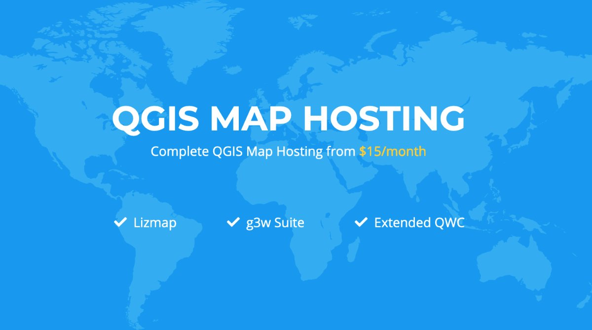

[](https://circleci.com/gh/g3w-suite/g3w-admin)


# G3W-SUITE

G3W-ADMIN admin server module for G3W-SUITE. (Django 2.2 and Python 3.6, current branch)

G3W-SUITE works with **QGIS-Server LTR versions**.




### Version

At the moment is not used a classic versioning system for the suite, there are main 3 branches.

| Branch | Python version | Django version | QGIS API |Status |
|--------|----------------|----------------|----------|-------|
| dev | 3.6 | 2.2 | Used | Continue developing |
| v.3.2.x | 3.6 | 2.2 | Used | Bug fixing |
| v.3.1.x | 3.6 | 2.2 | Used | Bug fixing |
| v.3.0.x | 3.6 | 2.2 | Used | No longer supported |
| dj22-py3 | 3.6 | 2.2 | Not used | No longer supported  |
| py2 | 2.7 | 1.11 | Not used |No longer supported  |

## ATTENTION!
To migrate from V.3.1.x to v.3.2.x to avoid migration issues follow instructions below:

before run *migrate* django commands
```
psql <connection_to_g3w_suite_db> -f db_scripts/pre_migration_v3.1.x_to_v3.2.x.sql
```
run **migrate** django command
```
python3 manage.py migrate
```
after run **migrate** django command
```
psql <connection_to_g3w_suite_db> -f db_scripts/post_migration_v3.1.x_to_v3.2.x.sql
```

The following instructions are for a Ubuntu 18.04 LTS.

## Installation of node.js and Yarn
G3W-ADMIN use javacript package manager [**Yarn**](https://yarnpkg.com/) and [**Node.js**](https://nodejs.org/it/)

```bash
sudo apt-get install -y nodejs-legacy npm
```

for install Yarn follow main installation instructions:

https://yarnpkg.com/en/docs/install#debian-stable

## Create virtualenv

[**Virtualenv**](https://virtualenv.pypa.io/en/stable/)

The following instructions are for python 3.6

Install python pip

```bash
sudo apt-get install python3-pip
```

now we can install virtualenvwrapper
```bash
sudo pip3 install virtualenvwrapper
```

To activate virtuenvwrapper on system login, add follow lines to 'bashrc' config file of your user
```bash
nano ~/.bashrc
....
export WORKON_HOME=<path_to_virtualenvs_directory>
source /usr/local/bin/virtualenvwrapper.sh
```

## Virtualenv creation
To create a virtualnenv is sufficent call mkvirtualenv commando follow by the identification name for virtualenv (to use QGIS API into a virtualenv only solution is to give access python system site-packages to it using *--system-site-packages* option)
```bash
mkvirtualenv --system-site-packages g3wsuite
```

## Install G3W-SUITE

First step is install dev libraries packages for python module to install with requiriments.txt

```bash
sudo apt-get install -y \
    libxml2-dev \
    libxslt-dev \
    postgresql-server-dev-all \
    libgdal-dev \
    python-dev
```


### Set local_config.py file
G3W-ADMIN is a Django application, and to work is necessary set a config.py file. To start copy local_settings.example.py and set the databse and other:
```bash
cd g3w-admin/g3w-admin/base/settings
cp local_settings_example.py local_settings.py
```

set database, media root and session cookies name:

```python
...

DATABASES = {
    'default': {
        'ENGINE': 'django.contrib.gis.db.backends.postgis',
        'NAME': '<db_name>',
        'USER': '<db_user>',
        'PASSWORD': '<db_user_password>',
        'HOST': '<db_host>',
        'PORT': '<db_port>',
    }
}

...

DATASOURCE_PATH = '<static_path_to_gis_data_source>'

...

MEDIA_ROOT = '<path_to_media_root>'

...

SESSION_COOKIE_NAME = '<unique_session_id>'
```

### With paver commands

G3W-ADMIN has a series of [paver](http://pythonhosted.org/Paver/) CLI commands to administrate the suite.
After prepared environment if sufficient invoce paver *install* task

```bash
paver install
```

### Run G3W-SUITE

To run the application with paver

```bash
paver start
```

and for stop
```bash
paver stop
```


G3W-ADMIN is a django application so is possibile run app by standard django manage.py commands

```bash
./manage.py runserver
```

## Deploy G3W-SUITE

As other Django application, G3W-SUITE can be deployed by its wsgi capabilities.
On the web if simple to find tutorial for deploy a Django application.

The simpler way is to use [Apache2](https://httpd.apache.org/) as server WEB and its [mod_wsgi](https://en.wikipedia.org/wiki/Mod_wsgi) module.

Alternative solutions are:


* [Apache2](https://httpd.apache.org/) + [mod_proxy](https://httpd.apache.org/docs/2.4/mod/mod_proxy.html) + [Uwsgi](https://uwsgi-docs.readthedocs.io/en/latest/)
* [Apache2](https://httpd.apache.org/) + [mod_proxy](https://httpd.apache.org/docs/2.4/mod/mod_proxy.html) + [Gunicorn](http://gunicorn.org/)
* [Nginx](https://nginx.org/) + [Uwsgi](https://uwsgi-docs.readthedocs.io/en/latest/)
* [Nginx](https://nginx.org/) + [Gunicorn](http://gunicorn.org/)


## Manual installation steps

The preferred installation is by using the `paver` script as mentioned above, but in case you need to customize the installation process, here are the build and setup steps:

### Build static js code


```bash
# Install yarn (requires root):
curl -sS https://dl.yarnpkg.com/debian/pubkey.gpg | apt-key add -
echo "deb https://dl.yarnpkg.com/debian/ stable main" | \
    tee /etc/apt/sources.list.d/yarn.list
apt-get update && sudo apt install -y yarn
# Back to unprivileged user, from the repository directory, run:
yarn --ignore-engines --ignore-scripts --prod
nodejs -e "try { require('fs').symlinkSync(require('path').resolve('node_modules/@bower_components'), 'g3w-admin/core/static/bower_components', 'junction') } catch (e) { }"
```

Make sure build components are available in static and collected later
```
cd g3w-admin/core/static
ln -s "../../../node_modules/@bower_components" bower_components
```

### Install requirements

Possibily within a virtual env:

```bash
pip install -r requirements.tx
```

### Django setup

```bash
python manage.py collectstatic --noinput
python manage.py migrate --noinput
```

Install some fixtures for EPSG and other suite options:

```bash
for FIXTURE in 'BaseLayer.json' 'G3WGeneralDataSuite.json' 'G3WMapControls.json' 'G3WSpatialRefSys.json'; do
    python manage.py loaddata  core/fixtures/${FIXTURE}
done
```

Sync menu tree items (re-run this command in case you installed optional modules and they are not visible in the admin menu tree):

```bash
python manage.py sitetree_resync_apps
```

## Module accessories

Can be installed the follow module accessories.

## Caching module
Module to cache on disk layers WMS map. To install and usd please read his [caching/README.md](caching/README.md)

## Filemanager module
Module to manage on disk geo data files. To install and use please read his [filemanager/README.md](filemanager/README.md)

## Continuous integration testing

CI tests are automatically run on CircleCI for the `dev` branch only.

The Docker compose configuration used in the CI tests is available at [docker-compose.yml](docker-compose.yml).

Another configuration for running local tests is provided with [docker-compose-local.yml](docker-compose-local.yml)
 and can also be used for local testing by running:

```bash
docker-compose -f docker-compose-local.yml up
```

The testing image is built from the dependency image and it will run all install and build steps from the local repository.

The dependency image is built from the [Dockerfile.deps](ci_scripts/Dockerfile).

### Contributors
* Walter Lorenzetti - Gis3W ([@wlorenzetti](https://github.com/wlorenzetti))
* Leonardo Lami - Gis3W ([@leolami](https://github.com/leolami/))
* Francesco Boccacci - Gis3W ([@volterra79](https://github.com/volterra79))
* Alessandro Pasotti - QCooperative ([@elpaso](https://github.com/elpaso))
* Luigi Pirelli - QCooperative ([@luipir](https://github.com/luipir))
* Mazano - Kartoza ([@NyakudyaA](https://github.com/NyakudyaA)) (Dockerization refactoring)
