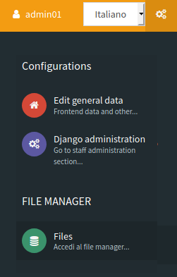
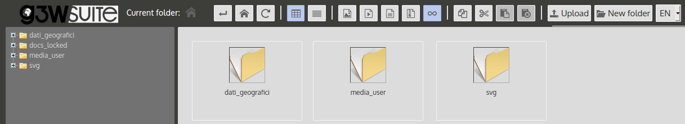

#  Management and organization of geographic data and QGIS projects
_**This section describes how to organize QGIS data and projects locally and how to synchronize them on the server environment for publication purposes**_

Thanks to the integration with the APIs of QGIS it is now possible to manage the main formats (geographic or not) supported by QGIS Server:

* **reading and editing mode**
  * PostGreSQL/PostGIS
  * Oracle Spatial (compiling QGIS Server)
  * SQLite/SpatiaLite
  * GeoPackage
  * ShapeFile

* **reading mode**
  * SQL Server
  * Virtual layer

The suite also allows you to manage the consultation and editing of:
 * **simple join data with no nesting limits**
 * **1:N relation data**
 * **N:M relation data**

## Data on DB Server

If your geographic data is stored on `Server DB`, it will be sufficient to allow access to the DB from the IP address on which the application is installed.

## Data on SpatiaLite/GeoPackage or OGR format
If your geographical data are stored on `SpatiaLite`, `GeoPackage` or an other physical files (`.shp`, `.kml`, `.tif`...) located on your local PC, you will need:
* **organize data and projects** in predefined local directories and subdirectories
* **upload/synchronize geographic data to the corresponding folder located on the server** where the application is installed

**Of course, mixed solutions with geographical data on PostGreSQL/PostGIS, SpatiaLite and other formats will also be possible.**

### Organization of data and projects

Data on physical files and / or on GeoDB SpatiaLite and QGIS cartographic projects must be organized in compliance with the following indications:
 * a **main directory** named and positioned in according to need's user
   * a **`project_data` sub-directory** that must contain the **geographic data** used for the various cartographic projects, such data can also be organized in subdirectories with no nesting limits.
   * a **`projects` sub-directory** that must contain the **QGIS cartographic projects** (.qgz or .qgs files)

**NB:** The name of the local directory dedicated to geographic data must correspond to the name defined for the **`DATASOURCE_PATH`** variable set during installation.
[See dedicated paragraph.](https://g3w-suite.readthedocs.io/en/v.3.4.x/settings.html#base-settings)

That directory is also used to contain **images used in the print layouts** associated with the QGIS cartographic projects.

### Geographic data synchronization on the server

The data stored in the local **`project_data`** directory must be synchronized on the server where the G3W-SUITE application is installed.

The geographic data stored in the local **`project_data`** folder must be loaded, reflecting any subdirectory structure.

To synchronize your data access to the Administration panel of G3W-ADMIN and click on the **`Configurations` icon**  located in the upper right corner.

Choose the **`File Manager`** item in the linked menu.

Using this tool it is possible to manage the physical geographic data on the server in a simple and intuitive way.

**The root directory of the File Manager corresponds to the local **`project_data`** directory**

It will therefore be necessary, in the case of using geographic files on the file system, to synchronize the contents of the local **`project_data`** directory (and any sub-directories) before proceeding with the publication of QGIS projects.

Two specific directories can also be created within the root directory of the File Manager:

 * **`media_user`**: a directory exposed on the web, to store your **multimedia files**
 * **`svg:`** a directory to store **extra SVG icons** used your QGIS projects

All the directories can be organized in subdirectories with no nesting limits.

**NB:** The names of these directories are defined by the basic settings set during the installation of the suite.
[See dedicated paragraph.](https://g3w-suite.readthedocs.io/en/v.3.4.x/settings.html#base-settings)

The example shows the case in which in the local **project_data** directory there are two directories (**geopackage** and **spatialite**) in addition to the two system directories (**svg** and **media_user**).

