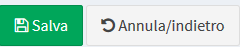
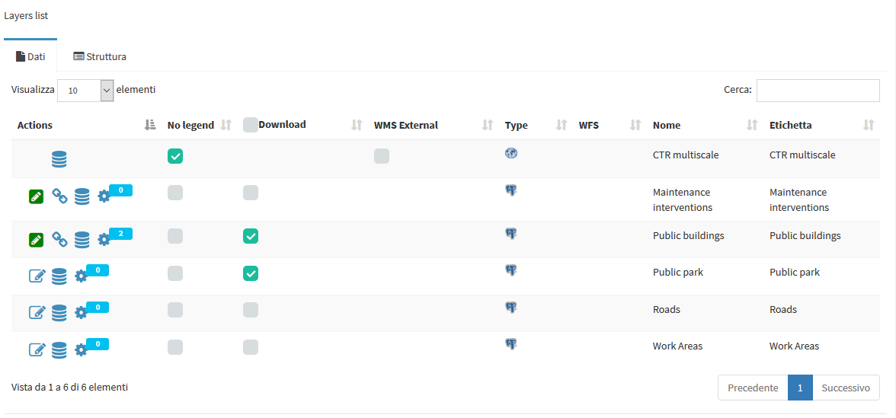
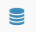
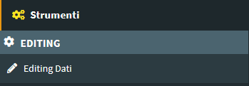

# Introduction

**_The tutorial is based on a QGIS project dedicated to the management of a layer representing a series of buildings located on the territory._**

**_In addition to the geographical aspects, the project involves the management of numerous and diversified attributes and of the related maintenance interventions through a 1: n type relationship._**

Through the tutorials it will be possible to:
 * customize the various graphic-functional aspects of the basic project
 * publish the project as a WebGis service
 * create personalized searches
 * activate the editing functionality by customizing associated forms and widgets
 

# Download the demo data

The tutorial is based on predefined data and QGIS 3.10 LTR project **downloadable from <a href="https://drive.google.com/file/d/1JpeZQgu90NQZ3tjBdD_V9BSaRkbWR1Ex/view?usp=sharing" target="_blank">this link</a>**.

The .zip file contains the **`G3W-SUITE`** directory with two sub directories:
 * **`projects`:** containing a QGIS project (**`buildings_management.qgz`**) already optimized for the tutorial
 * **`project_data/spatialite`**: containing a SpatiaLite DB with basic data (**`build_management.sqlite`**)

Inside the **`build_management.sqlite` SpatiaLite DB** there are the following layers:
 * **`buildings` (polygon layer):** reference layer for editing aspects
 * **`maintenance_works` (alphanumeric table):** with the maintenance interventions associated with the individual buildings
 * **`park` (polygon layer):**
 * **`roads` (linear layer):** a simple road network
 * **`work_areas` (polygon layer):** with the perimeter of work areas to be used to define any geo-constraints

**IMPORTANT: a copy of this data are present on the server, you can not change your local data copy**

The project (**based on QGIS LTR 3.10**) foresees:
 * a **dressing categorized by the `buildings` layer** based on the categorical field **`type`**
 * the presence of a **1: n relationship** between the `buildings` layer and the alphanumeric **`maintenance_works`** table
 * pre-developed **query forms** for the **`buildings`** layer and the **`maintenance_works`** table
 * predefined **editing widgets** for the fields of the two main layers: **`buildings`** and **`maintenance_works`**
 * two **print composer** in A4 and A3

## Modify the QGIS project title

The publication system provides for the use of the **title of the project** as the **unique identifier of the WebGis service**.

**So, before publishing the project, it will be NECESSARY to change the title associated with the basic project (`Project -> Properties ... - Session: General`)**

# Access the online service

To publish the project, you can **access the G3W-SUITE test application** via the following URL: [**`https://v30.g3wsuite.it`**](https://v30.g3wsuite.it)

To access the **Administration Panel** it is necessary to log in using the following credentials:
 * user: **`demo`**
 * password: **`G3wsuite!`**
 
**In case of login problems, report the problem to `info@gis3w.it`**
 
 

# Publish the QGIS project as a WebGis service

After authentication it will be possible to access the **`Administration session`** and view the **Dashboard**.

In the Dashboard there will be the menu for access to the **Cartographic Groups** pertaining to your user and the menus relating to additional modules not active in this demo.

Click on the **`Show`** item in the ligth blue **Groups** box to acces at the list of available Cartographic Groups.

Access the list of webgis in the Cartographic Group **`G3W-SUITE Demo`** clicking on the project number shown.

Now click on the button  to publish your **QGIS project**.

Fill out the form defining the various aspects to be associated with the WebGis service being published:
## QGIS project
**`QGIS file`:** load the QGIS cartographic project to be published (.qgz or .qgs file)

## ACL Users
Management of access permissions
 * **`Viewers users`:** define the individual users (Viewers) who have the credentials to view the WebGis service. By choosing the anonymous user (**AnonymusUser**) the group will be freely accessible.
 * **`Viewer user groups`:** you define the user groups (Viewer) which have the credentials to view the content of the service.

## Default base layer
In this session you define which **`base layer` should be active at startup**.

The choice is limited to the list of base layers activated for the cartographic group in which you work.

It is also possible not to define any active base layer at startup.

## Description data
 * **`Public title`:** Title to be associated with the project and displayed on the client header.
If left blank, the title associated with the QGIS project will be used or, in the absence of this, the name of the project file
 * **`Description`:** Description of the project, it will appear at the public portal level.
 * **`Thumbnail (Logo)`:** logo to associate with the project. This image will be viewable in the list of projects within the cartographic group
 * **`URL alias`:** a human readable URL for the map

**ATTENTION:** contents marked with * are mandatory.

After filling in the various form, click on the **`Save button`** to confirm your choices.

**If the publication was successful, the QGIS project will appear in the list of projects in the Cartographic Group.**

 Clicking on the **`View map`** icon will access the WebGis service in consultation.

# Update the published WebGis service

If you want to modify some graphic-functional aspects of your WebGis service, modify your QGIS project and update the WebGis service by clicking on the **`Modify`** icon .

Reupload the QGIS project with your changes, click on the **Save button** and see the resuts on the cartographic client.

# Activation of additional functions

Once your project has been published, you can access the list of widgets and additional functions to enrich your WebGis service.

## Widget management
Thougth the **`Layers list` icon**  it is possible to access the list of the geographical states that compose it and define some functional aspects that will be enabled at the cartographic client level.

The new session will show you the **list of the layer** present in the published QGIS project

Next to each layer are a series of icons and checkboxes:
 *  **Caching Layer:** allows you to activate and manage the cache of the single layer at the project level
 *  **Editing layer:** shows if the online editing function is active on the layer and allows you to activate and define it
 *  **List of widgets:** shows how many widgets (eg searches) are associated with this layer and allows you to activate new ones
 * **No legend:** it allows to define if the layer must have published the legend at TOC level of the WebGis client
 * **Download as shp:** allows the download of the geographic layer, in .shp format
 * **Download as xls:** allows the download of the layer (geographic or not), in .xls format
 * **WMS external:** to speed up loading, the WMS layers present in a QGIS project are managed directly by Django and not by QGIS-Server. However, this method prevents the application of any styling  (e.g. opacity level) defined at the project level. The choice of the external WMS option means that the WMS layer is managed directly by QGIS-Server and therefore the associated styling is applied.
 *  **Type:** illustrates the type of data (WMS, PostGis, SpatiaLite, GDAL / OGR ...)
 * **WFS:** a check mark shows whether the layer is published as a WFS service or not
 * **Name:** name of the layer
 * **Label:** layer alias applied at the QGIS project level

**Try to activate the available options and test the result on the WebGis**

## Search widget creation

To create a search tool available at WebGis level, **choose the vector layer** on which to apply the tool and **click on the `Widget list icon` ** 

A series of **searches already carried out** for this layer by other users will probably be listed.

You can activate them by **clicking on the `Linked` chekbox**.

The listed searches can be **modified, deleted or unlinked** using the appropriate icons.

To **create a new search**, click on the blue link **`New widget`**.

In the related form we can define:
 * **Form Title**
   * **`Type`:** choose **`Search`** option
   * **`Name`:** name that G3W-SUITE will use to internally register the search widget.
 * **General configuration of research and results**
   * **`Search title`:** title that will become available in the **'Research'** panel of the WebGis interface
 * **Search fields settings**
   * **`Field`:** field on which to carry out the research
   * **`Widget`:** method of entering the value to be searched
             InputBox: manual compilation
             SelectBox: values ​​shown via drop-down menu (only for PostGis or SpatiaLite layers)
   * **`Alias`:** alias assigned to the field that will appear in the search form
   * **`Description`:** description assigned to the field
   * **`Comparison operator`:** comparison operator (**`=, <,>,> <,> =, <=, LIKE, ILIKE`**) through which the search query will be carried out. The LIKE and ILIKE operators will only be available for PostGis or SpatiaLite layers
   * **`Dependency`:** this parameter (optional) allows, only in the case of SelectBox widgets, to list the list of values ​​of a field filtered according to the value defined for the previous fields. The tool allows, for example, to display, in the drop-down menu dedicated to the choice of cadastral particles, only the particles connected to the sheet chosen in the previous option. This function is only available for PostGis or SpatiaLite layers.

The green button **Aggiungi** allows you to add additional fields for the construction of the search query currently manageable through the **AND operator** alone.

Here a simple example based on the fields **`type`** and **`volume`** othe **`buildings`** layer:

Once the form has been filled in, click on the **`OK button` to save** the settings.

Once the settings are saved, the created widget will appear in the list of Widgets associated with the layer.

**The widget will already be **`linked`** and therefore available in the WebGis interface on the left panel.**

# Editing on line
_**Forms and editing widgets are already defined on the project associated with the tutorial for the geometric layer of buildings and for the alphanumeric table related interventions_maintenance.**_

 * **`Buildings`**
   * **id** (integer - primary key): autogenerate
   * **name** (text NOT NULL): text edit
   * **address** (text): Value relation (roads layer - code/name fileds)
   * **year** (integer NOT NULL): unique values (2015,2016,2017,2018,2019,2020)
   * **photo** (text): attachment
   * **link** (text): text edit
   * **form** (text): attachment
   * **high** (integer NOT NULL): range (10-30 step 2)
   * **volume** (integer): range (50-200 step 10)
   * **surface** (integer): text edit
   * **architectural_barriers** (text): Checkbox (Checked - Not checked)
   * **date_barriers** (date): date (yyyy/MM/dd)
   * **safety_exits** (text): Checkbox (Checked - Not checked)
   * **date_exits** (date): date (yyyy/MM/dd)
   * **fire_system** (text): Checkbox (Checked - Not checked)
   * **date_fire** (date): date (yyyy/MM/dd)
   * **type** (text NOT NULL): unique values (Administrative, Commercial, Residential)

 * **`Maintenance_works`**
   * **id** (integer - primary key): autogenerate
   * **id_buildings** (text - relation key): text edit
   * **maintenance** (text NOT NULL): unique values
   * **date** (date): date (yyyy/MM/dd)
   * **form** (text): attachment
   * **value** (integer): range (10-30 step 2)

To activate the editing function on webgis, access the list of layers and identify the two layers shown above.

Clicking on the icon **Editing layer**  (placed at the left of each rows) will open a modal window that will allow you to:
 * define the **`editing activation scale`** (only for geometric tables)
 * define the **`Viewer users`** (individuals or groups) **`enabled`** for online editing

With regard to the last aspect, it should be noted that **Viewers users** (individuals or groups) **available** in the drop-down menu **will be limited to those who have allowed access in consultation to the WebGis project**

Once the editing function is activated, updating the service, the **`Tools menu` will appear on the left panel.**

**By activating the editing function it will be possible to edit the geometries and attributes of the Public Buildings layer and the related interventions.**

 

For **further information** on the web editing function, read the [**dedicated chapter on the manual**](https://g3w-suite.readthedocs.io/en/latest/g3wsuite_editing.html#online-editing-tools-at-cartographic-client-level)

# Personalize your demo

**Do you want to test the online editing function more deeply?**

Redefine attribute forms, aliases and editing widgets associated with the individual fields and reload the project to check the new settings.

**It is advisable to consult the [paragraph dedicated](https://g3w-suite.readthedocs.io/en/latest/g3wsuite_editing.html#activation-and-configuration) to the list and limitations of the individual editing widgets inheritable from the QGIS project.**

