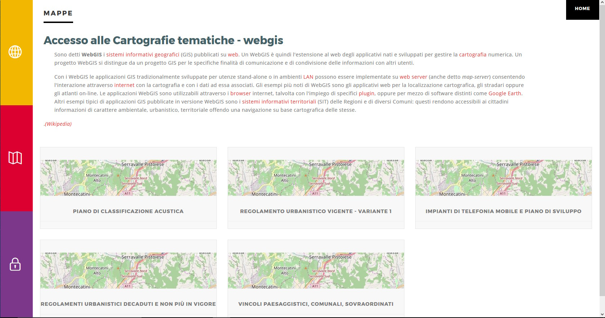

# G3W-FRONTEND: the front end portal
_**This section describes the different sections of the access portal and how to login to the Administration Panel**_

## The login portal sessions
The G3W-SUITE application is accessible via any internet browser (FireFox and Chrome recommended) via the URL address defined during installation

If you have also installed the front-end portal from the [GitHub repository](https://github.com/g3w-suite/g3w-admin-frontend), access to the application will be via the portal itself.

The front-end portal contains a brief presentation of the service and a side menu with the following items:
 * **`About it`**
 * **`Maps`**
 * **`Login`**

Most of the information shown in the access portal can be defined from the **`Configurations -> Edit General Data` session**, accessible from the icon located in the upper right corner of the Administration Panel.

### About it
The **About it** session can contains a small introduction and contact information for your company or public facility.

### Maps
Within G3W-SUITE it is possible to organize webgis services in hierarchical containers (**Cartographic Macrogroups and Cartographic Groups**)

By accessing the **Maps** session, the **Macrogroups** (if present) will be displayed, access to the Macrogroup will allow you to view the associated **Cartographic Groups** and from these access the list of individual **WebGis services**.

The MacroGroups, Groups and WebGis services listed will be those defined as free access.

If you have a user for access, you can authenticate yourself through the **Login session**.

Following authentication, the **Maps** page will also show the MacroGroups, Groups and WebGis services with restricted access and on which the user has access permissions.

### Login
If you have a user with login credentials, you can authenticate yourself through this session by entering your user and password.

If you are an **Administrator** or **Editor** of 1 or 2 level, you can also access the Administration session.

Once logged in, you access the **Admin** session and from here, via the **"Backend"** button to the Administration panel

