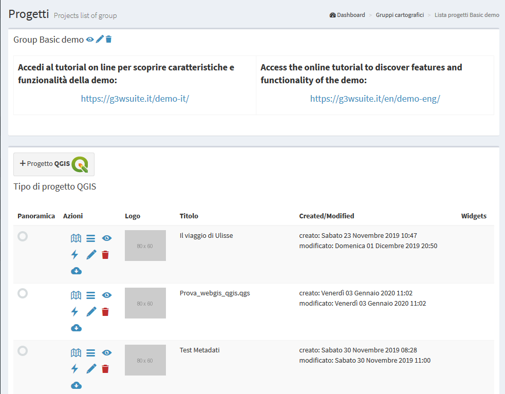

# G3W-ADMIN: the Administration panel
The Administration Panel allows you to manage all aspects related to the publication of QGIS projects and configuration of related WebGis services

The main page of the Administration Panel shows:
 * **a bar at the top:**
   * **Frontend:** to return the access portal
   * **Username:** to edit your profile and log out
   * **Language:** to choose the interface language
   * **A gear icon : to access a menù with:
       Edit general data: to set informations shown in the front-end portal 
       Django Administration (only for Admin01 user): to configure Django advanced settings
       Files: to access the File Manager tool
 * **a text menu on the left:**
   * **Dashboard:** Administration dashboard
   * **Cartographic Groups:** to create/manage cartographic groups
   * **Macro Cartographic Groups:** to create/manage Cartographic MacroGroups
   * **Users:** to create/manage single users and/or user groups
   * **List of active modules:** to activate/manage the functional modules active in your installation
 * **a dashboard in the center of the page**
   * **Dashboard:** to access to list of Cartographic Groups
   * **Module list:** to access the respective settings
 

## Front end portal customization
From the main page of the **Administration Panel** it is possible to customize the information shown on the Front End Portal.

Click on the **Configurations** icon  located at the rigth bottom and choose the item **Edit general data** which will appear in the menu below.

In the **General suite data** form you can define: * **Home data:** info that will appear on the portal home page
 * **Home data:** info that will appear on the front end landing page
 * **About data** info that will appear in the **About it** session
 * **Group map data:** info that will appear in the **Maps** session
 * **Login data:** info that will appear in the **Login/Administration** session
 * **Social media data:** links to the social channels that will appear in the **About it** it session
 * **Map Client data:** main title to be displayed in the cartographic client bar
 
### Front End Home Data
Informations that will appear on the front end landing page

**ATTENTION:** contents marked with * are mandatory.

### Front End About Data
Informations that will appear in the **About it** session

**ATTENTION:** contents marked with * are mandatory.

### Frontend Groups Map Data
Information that will be displayed in the **Maps** session

**ATTENTION:** contents marked with * are mandatory.

### Front End Login Data
Information that will be displayed in the **Login/Administration** session

**ATTENTION:** contents marked with * are mandatory.

### Front End Social Data
Links to the social channels that will be displayed in the **About it** it session

**ATTENTION:** contents marked with * are mandatory.

### Map client data
Main title to be displayed in the cartographic client bar

In the **Credits** subsection it is possible to define additional text for the publishing aspects.

After filling in the various form, click on the Save button to confirm your choices.

## Hierarchical organization of WebGis services and types of Users (roles)
This paragraph allows you to understand how G3W-SUITE makes it possible to manage the individual WebGis services in a structured and hierarchical way.

As already described, the organizational levels are two:
 * Cartographic MacroGroups
   * Cartographic groups

These organizational levels can be associated with different types of users (Editor 1, Editor2 and Viewer) in order to manage the access / management powers to the individual elements in a granular way

The example shown in the following graph is that relating to the case of a Union of Municipalities where we need to organize the various WebGis services in containers that identify the individual municipal administrations and individual services.

Access policies and individual functional modules may be associated with each WebGis service.

### Types of Users (Roles)
The user management session allows you to create **Users** and **Users Groups** and associate them with specific roles:
 * **Admin1:** user with full powers **including** Django administration (basic suite configuration)
 * **Admin2:** user with full powers **excluding** those of Django administration (basic configuration of the suite)
 * **Editor1:** administrator of one or more Cartographic MacroGroups for which it will be possible:
   * create users and/or user groups
   * create Cartographic Groups and, if necessary, assign them to an Editor 2 user
   * publish WebGis services and define their access policy
   * activate and configure some functional modules
 * **Editor2:** administrator of one or more Cartographic Groups for which it will be possible:
   * publish/update WebGis services and define their access policy
   * activate and configure some functional modules
 * **Viewer:** user with access permission in consultation on WebGis services characterized by authentication. This user can also use individual functional Modules if the relative permissions have been attributed to him
 * **Anonymus User:** user to be associated with WebGis services and/or functional modules with free access

### Hierarchical organization of contents
The following paragraph is dedicated to better understanding the relationships between the different types of users and the different elements of the suite (MacroGroups, Map Groups, WebGis services ...).

It is important to remember that while to publish a WebGis service you must first create a Cartographic Group that contains it, the creation/management of Cartographic MacroGroups (and associated Editor 1 users) is optional.

**If the use of MacroGroups is not necessary, the use of Editor 1 users is not recommended.**

The two cases are described below.

#### Absence of MacroGroups
In case it is not need use MacroGruppi, the Admin user will be the only administrator of the suite and can therefore:
 * create users (individuals and/or groups) of various types
 * create **Cartographic Groups**
 * publish **WebGis services** within the individual **Cartographic Groups**
 * activate some specific modules on individual WebGis services

When creating a cartographic group, the Admin user can define:
 * the eventual user (individual/group) **Editor 2** to associate the Group with
 * **Viewers** users (individuals/groups) who will have access to this container

In the event that the Cartographic Group is assigned to **Editor 2** (single or group users), they will may autonomously publish/update WebGis services inside in this container. 

**Editor 2** users will also be able to define the access policies to the published WebGis services, limited to the Viewers users associated with the Cartographic Group by the Admin user.

Even the **Admin** user can publish **WebGis services** within a Cartographic Group and, if necessary, associate them with a user (single and/or group) of **Editor 2** type.

#### Presence of MacroGroups
The **Macrogroups** are thematic containers dedicated to the individual superstructures of your company/public administration (e.g. Municipal Administrations of a Union of Municipalities) within which can be created Cartographic Groups dedicated to individual Services (e.g. Registry Office, Public Works, Urban Planning ...) 

Each **Thematic Group** will welcome individual WebGis services.

**Macrogroups** can be created only by **Admin** users.

Each **Macrogroup** can be associated with only one **Editor1** user.

Each MacroGroup can be considered as a watertight compartment within which the associated Editor 1 user (administrator in full of the MacroGroup), will be able to create users and user groups that will be made available to define access permissions for content (Groups Maps, WebGis services, functional modules ...) of the reference MacroGroup only.

In this way it will be possible to create totally independent entities, the MacroGroups, which will be managed exclusively by the user Editor 1 associated with them.

Clearly the Admin users (1 and 2) will continue to have full powers on all groups present in the system

As previously specified, **Editor 1** user will be able to:
 * create **users** (single and/or groups) of type Editor2 and Viewer
 * create **Cartographic Groups** within its **Macro Group**
 * publish **WebGis services** within his **Cartographic Groups**
 * activate **specific modules** on individual **WebGis services**

When Editor 1 user creates a Cartographic Group, he can define:
 * the eventual **Editor2** user (individual/group) to associate with this Group
 * **Viewers** users (individuals/groups) who will have access to this container

### Summary table of access/administration policies
Below is a summary table of the powers associated with the different roles.

## Users and Users Groups management
In the left side menu there is the USERS item with four sub-items:
 * **Add user**
 * **Users list**
 * **Add groups users**
 * **Groups users list**
 
### Add user
Through this form it is possible to insert new users and define their characteristics.

 * Anagraphic: first name, last name and email address
 * Login: username and password
 * User backend
 * ACL / Roles
   * Superuser status (Admin1 and Admin2 users only)
   * Staff status: deep administration of the application (Admin1 users only)
   * Main roles (Editor1, Editor2 or Viewer)
   * User editor groups: user groups Editor of belonging
   * any groups of Viewer users to which they belong
 * User data:
   * Departments and image to be associated with the profile

After filling in the various form, click on the Save button to confirm your choices.

### Users list
Through this form you can consult the list of enabled users and their characteristics:
 * Username
 * Roles
 * User groups to which they belong
 * Associated Cartographic MacroGroups (only for Editor1 users)
 * Super user and/or Staff privileges
 * Email, name and surname
 * Creation date
 * Info on user creation (G3W-SUITE or LDAP)
 

The icons at the head of each row, allow you to:
 *  **Modify:** to modify the characteristics of the user
 *  **Delete:** to permanently delete a user
 
### Add Group Users
Through this form it is possible to insert new user groups and define their role.

It is possible to create only two types of user groups:
 * **Editor:** in which only Editor2 users can be inserted
 * **Viewer:** in which only Viewer users can be inserted

The association between user and user groups is made at the individual user management level.

In the specific form for creating user groups, the following are defined:
 * **Name**
 * **Role** (Editor or Viewer)
 

 
After filling in the from, click on the **Save** button to confirm your choices.

### Groups users list
Through this form it is possible to consult the list of enabled user groups, their characteristics and the individual users belonging to the group.

Using the icons at the head of each row, you can:
 *  **Show details:** to consult the characteristics of the user group 
 *  **Modify:** to modify the characteristics of the group 
 *  **Delete:** to permanently delete a group and therefore association with users belonging to the group itself 

## Macro Cartographic Groups
In this section it is possible to view the list of Cartographic Macrogroups, manage them and create new ones.

For example, you can create a **Macrogroup** to collect a series of **Cartographic Groups** belonging to the same Administration (single Municipality within a Union of Municipalities) or more simply to have main containers that contain second level groupings (Groups).

In the left side menu there is the **MacroGroup Cartographic** item with two sub-items:
 * **Add MacroGroup:** to create a new Cartographic MacroGroup
 * **MacroGroups list:** to access the list of MacroGroups present
 
### Add MacroGroups
Through this item, available only for the **Admin** users, it will be possible to create a new Cartographic MacroGroup and associate it with an Editor1 type user who will become its administrator.

Let's see in detail the various sub-sessions of the group creation form.

#### ACL users
**Editor users:** you define the Editor1 user who will become the MacroGroup administrator. This user will can manage the MacroGroup by creating Cartographic Groups, publishing projects and creating Users or Associated User Groups.

#### General data
 * **Title*:** descriptive title of the MacroGroup (will appear in the list of MacroGroups)
 * **Use title and logo for client” option:** by default, the map client header, for each WebGis service, is instead made up of:
   * main title (definable at General Data management level)
   * logo and title associated with the Thematic Group
   * title of the WebGis service.
 * **Img logo*:** the logo to be associated with the MacroGroup in the frontend and, eventually, in the client header

After compiling the form, click on the Save button to confirm your choices.

### MacroGroups list
The menu provides access to the list of cartographic macro-groups present.

There are a series of icons to access specific functions:
 *  **Show the details** of the MacroGroup
 *  **Change** characteristics of the MacroGroup
 *  **Delete** MacroGroup

**ATTENTION:** the removal of the Cartographic MacroGroup group will result in:
 * the **removal of all the Cartoghraphic Groups** contained in it
 * the **removal of all the cartographic projects** contained in the individual Groups
 * the **removal of all the widgets** (eg searches) that would remain orphaned after the removal of the cartographic projects contained in the group. See the Widget chapter for more information.

#### Define the MacroGroups order on the FrontEnd
Through the Drag & Drop function it is possible to define the order of the MacroGroups in the list. This order will be reflected in the FronEnd.

## Cartographic Groups
In this section it is possible to view the list of Cartographic Groups present, manage them and create new ones.

A Cartographic Group is create  to **collect a series of cartographic projects belonging, for example, to the same theme** (Urban Planning Regulations, tourist maps ...) and characterized by the same projection system.

It should be remembered that it will be possible to switch from one webgis service to another, leaving the same geographical extension and scale, only between the projects contained in the same cartographic group.

In the left side menu there is the **Cartographic Groups** item with two sub-items:
 * **Add Group:** to create a new Cartographic Group
 * **Group List:** to access the list of groups present

You can also access the list of groups by clicking on the **"Show"** button in the **Cartographic Groups** box on the **Dashboard**.

### Add Group
Through this item it is possible to create a new Cartographic Group.

During creation, some functional characteristics and tools that the WebGis interface will show for all cartographic projects published within the group are also defined.

Let's see in detail the various sub-sessions of the group creation form.

#### General data
 * **Name*:** group identification name (will appear in the group list)
 * **Title*:** descriptive title of the group (will appear in the list of groups)
 * **Description:** description of the content
 * **Language*:** interface language
    
#### Logo/Picture
 * **Header logo img*:** the logo to be displayed in the header del client cartografico
 * **Logo link:** a eventual link to associate with the logo
    
#### ACL Users
Access and modification powers are managed.

The options present will vary according to the type of user (Admin or Editor1) who creates / manages the Group
 * **Editor1 User:** defines the user (Editor1) manager of the Group.
     The entry is present only when the Admin type user creates the Group
     If the Group is created by a user of type Editor1, the Group is associated directly with that user
 * **Editor2 User:** defines the user (Editor2) manager of the Group.
 * **Viewers users:** define the individual users (Viewers) who have the credentials to view the contents of the group. By choosing the anonymous user (AnonymusUser) the group will be free to access
 * **Editor user groups:** define the user groups (Editor2) who manage the Group.
 * **Viewer user groups:** you define the user groups (Viewer) which have the credentials to view the contents of the group.

The option **Propagate NEW viewers and new viewers user groups permissions** allows you to propagate any changes relating to the Viewer users (individuals and / or groups) of the Group to ALL the WebGis services present in it.

This option cancels any differentiation in the access policies applied to the WebGis services contained in the Group.

#### MacroGroups
Possible definition of the belonging MacroGroup.

This option is available only if Cartographic macro groups have been created

In the event that the Group is created by an Editor1 type user, the Group will be automatically associated with the MacroGroup associated with the same Editor1.

#### GEO data
Projection system associated with the group.

**N.B.** All projects loaded into the group must be associated with this SRID.

#### Base layers and Map default features
In this box you can define:
 * **Mapcontrols*:** list of tools available on the WebGis client:
   * **zoomtoextent:** zoom to the initial extension
   * **zoom:** zoom in and zoom out
   * **zoombox:** zoom tool based on drawing a rectangle
   * **query:** puntual query of geographical layers
   * **querybbox:** query via bounding box (**N.B. for the layers to be queried according to this method it is necessary that they are published as WFS services on the QGIS project**)
   * **querybypolygon:** it will be possible to automatically query the features of one or more layers that fall inside a polygonal element of a guide layer. (Eg what's inside a cadastral parcel?). - **N.B. searchable layers must be published as WFS services on the QGIS project**
   * **overview:** presence of a panoramic map
   * **scaleline:** presence of the scale bar
   * **scale:** tool for defining the display scale
   * **mouseposition:** display of mouse position coordinates
   * **geolocation:** geolocation tool (useful for consultation from tablet)
   * **nominatin:** address search tools and toponyms based on OSM
   * **streetview:** Google StreetView on your map
   * **length:** linear measuring instrument
   * **area:** surface measuring instrument
   * **addlayers:** tool for temporarily uploading GeoJson, KML and SHP (zipped) vector layers to WebGis
   * **screenshot:** tool to take a screenshot of the map area
 * **Baselayer:** choice of the base maps that will be available on the WebGis client
 * **Background color:** choice of the background color of the maps (default white)

#### Copyrigth
**Terms of use:** description of the terms of use of the map and any other info
**Link to terms:** link to text

After filling in the various form, click on the **Save** button to confirm your choices.
 

### Groups List
From this item you can access the list of the created cartographic groups.

For each group, the Title and Subtitle defined at the time of creation are shown.

There are also a series of icons to access specific functions:
 *  **Add a new project** to be published on the WebGis service
 * Number and links to projects published within the Group
 *  **Show group details**
 *  **Change** group characteristics
 *  **Delete** group

**ATTENTION:** the removal of the cartographic group will involve:
 * the **removal of all the WebGis services** contained therein
 * the **removal of all widgets** (eg searches) that would be orphaned after the removal of the WebGis services contained in the group. See the Widget chapter for more information.

A large **+ icon** is available to access the form for creating a new group.

#### Define the Groups order on the FrontEnd
Using the Drag & Drop function it is possible to define the order of the Groups in the list.

This order will be reflected within the belonging MacroGroups.

**NB:** currently in the list of Groups it is not present in the subdivision in the belonging MacroGroups but the fact that a Group can be associated with only one MacroGroup still allows you to manage intuitively what will be the complessive display order.

## Publication/Management of new WebGis services
### To publish a new QGIS cartographic project
It is possible to publish new QGIS projects:
 * **from the list of cartographic groups:** click on the  icon located under the box of the cartographic group in which you want to publish the project.
 * **from the list of cartographic projects published within a group:** by clicking on the the buttom 

In the dedicated form we could define the charatteristicsof the project being published:

#### QGIS project
**QGIS file*:** load the QGIS cartographic project to be published (.qgz or .qgs file)

#### ACL Users
Management of access and/or modification permissions

The options present will vary according to the type of user (Admin, Editor1 or Editor2) who creates / manages the WebGis service.
 * **Editor1 user:** defines the user (Editor1) manager of the WebGis service.

The entry is present only when the WebGis service is created by Admin or Editor1 user.

In the event that the WebGis service is published by a user of type Editor1, the WebGis service is associated directly with that user
 * **Editor2 User:** defines the user (Editor2) manager of the WebGis service.
 
   The item is present only when the user of the Admin or Editor1 type creates the service
 WebGis. 
   In the event that the WebGis service is published by a user of type Editor2, the WebGis service is associated directly with that user

 * **Viewers users:** define the individual users (Viewers) who have the credentials to view the WebGis service. By choosing the anonymous user (**AnonymusUser**) the group will be freely accessible.
 * **Editor user groups:** define the user groups (Editor2) who manage the service.
 * **Viewer user groups:** you define the user groups (Viewer) which have the credentials to view the content of the service.

#### Default base layer
In this session you define which base layer should be active at startup.

The choice is limited to the list of base layers activated for the cartographic group in which you work.

It is also possible not to define any active base layer at startup.

#### Description data
 * **Description:** Description of the project, it will appear at the public portal level.
 * **Thumbnail (Logo):** logo to associate with the project. This image will be viewable in the list of projects within the cartographic group

#### Options and actions
These options allow you to define the type of WMS / WFS query to be carried out and the maximum number of results obtainable following a query.
 * **Max feature to get for query*:**
 * **Query control mode*:**
 * **Query by bbox control mode*:**
 * **Query by polygon control mode*:**

**ATTENTION:** contents marked with * are mandatory.

After filling in the various form, click on the Save button to confirm your choices.

If the operation is successful we will see the new project appear in the list of projects in in the working Cartographic Group.

### Define the Groups order on the FrontEnd
The individual WebGis services will be arranged, within the Thematic Groups to which they belong, in alphabetical order based on the title of the service.

## Manage/Update WebGis services
WebGis services are managed within the individual cartographic groups they belong to.

Access to the cartographic group will allow you to view the characteristics and parameters associated with the group.

To access the list of WebGis services, click with the link associated at the highlighted number of projects.

### Basic tools

In this section it is therefore possible to view the list of cartographic projects present, view them, manage them and create new ones.

Through the single icons, placed at the level of each project, it is possible to:
 *  **Display the cartographic project on the WebGis interface:** to check the display by the user
 *  **Access the list of layers** present within the project and define their functional aspects
 *  **View the project specifications**
 *  **Update a project:** update of the QGIS file and other options related to the project
 *  **Remove a cartographic project**
   **Warning:** removing a project also removes all the widgets (e.g. searches) that would be orphaned after the project has been removed
 *  **Download of the QGIS project**
 *  **Test the WMS Capabilities** of the project

### Setting up the overview map for WebGis services
In this session it is also possible to define which of the cartographic projects loaded within the group will be used as a panoramic map.

To set the panoramic map, choose the projects and tick the check box in the **Overview** column.

## Widget management
Once a cartographic project has been published, thougth the icon  it is possible to access the list of the geographical states that compose it and define some functional aspects that will be enabled at the cartographic client level.

Next to each layer are a series of icons and checkboxes:
 *  **Caching Layer:** allows you to activate and manage the cache of the single layer at the project level
 *  **Editing layer:** shows if the online editing function is active on the layer and allows you to activate and define it
 *  **List of widgets:** shows how many widgets (eg searches) are associated with this layer and allows you to activate new ones
 * **No legend:** it allows to define if the layer must have published the legend at TOC level of the WebGis client
 * **Download:** allows the download of the layer, in .shp format, at the TOC level of the WebGis client
 * **WMS external:** to speed up loading, the WMS layers present in a QGIS project are managed directly by Django and not by QGIS-Server. However, this method prevents the application of any styling  (e.g. opacity level) defined at the project level. The choice of the external WMS option means that the WMS layer is managed directly by QGIS-Server and therefore the associated styling is applied.
 *  **Type:** illustrates the type of data (WMS, PostGis, SpatiaLite, GDAL / OGR ...)
 * **WFS:** a check mark shows whether the layer is published as a WFS service or not
 * **Name:** name of the layer
 * **Label:** layer alias applied at the QGIS project level

## Search widget setting
In G3W-SUITE it is possible to create search widgets.

They will be saved by referring to the layer identifiers (for example the DB parameters: IP, DB name, schema, layer name).

This aspect allows, once a search widget for a layer has been created, to have it available on all the projects in which the layer is present, without having to rebuild the widget from scratch each time.

In the list of layers present within the project, **identify the layer on which to create and associate the search widget** and click on the icon 

By clicking on the icon, the list of already active (or activatable) widgets associated with the layer will be shown.

These widgets can be **modified, deleted or disconnected** using the appropriate icons.

**ATTENTION: deleting a search** will delete it from all projects in which that search is active.

To **deactivate a search** from a project, simply disconnect it using the check-box on the right.

To **create a new search**, click on the link **New widget**.

In the pop-up that appears, the **"Search" type** have to be chosen.

In the related form we can define:
 * **Form Title**
   * **Type:** "Search"
   * **Name:** name that G3W-SUITE will use to internally register the search widget.
 * **General configuration of research and results**
   * **Search title:** title that will become available in the **'Research'** panel of the WebGis interface
 * **Search fields settings**
   * **Field:** field on which to carry out the research
   * **Widget:** method of entering the value to be searched
             InputBox: manual compilation
             SelectBox: values ​​shown via drop-down menu (only for PostGis or SpatiaLite layers)
   * **Alias:** alias assigned to the field that will appear in the search form
   * **Description:** description assigned to the field
   * **Comparison operator:** comparison operator (**=, <,>,> <,> =, <=, LIKE, ILIKE**) through which the search query will be carried out. The LIKE and ILIKE operators will only be available for PostGis or SpatiaLite layers
   * **Dependency:** this parameter (optional) allows, only in the case of SelectBox widgets, to list the list of values ​​of a field filtered according to the value defined for the previous fields. The tool allows, for example, to display, in the drop-down menu dedicated to the choice of cadastral particles, only the particles connected to the sheet chosen in the previous option. This function is only available for PostGis or SpatiaLite layers.

The button 
 allows you to add additional fields for the construction of the search query currently manageable through the AND operator alone.

The example below shows the compilation of the form for creating a search widget dedicated to a cadastral cartography layer.

Once the form has been filled in, click on the OK button to save the settings.

Once the settings are saved, the created widget will appear in the list of Widgets associated with the layer.

The widget will already be "connected" and therefore available in the WebGis interface.

**IMPORTANT:** the created search widget will now be available (disconnected) for all projects in which the layer with which it has been associated will be present.

**This will allow you not to have to recreate the widget several times and to decide in which projects to activate the search and in which not.**

