# G3W-ADMIN: the Administration panel

_**This section describes how to manage the various aspects and features of the Suite:**_
 * _**customization of the access portal**_
 * _**user creation and management (individuals and groups)**_
 * _**creation of MacroGroups and cartographic Groups and definition of access and management policies**_
 * _**publication of QGIS projects as WebGis services**_
 * _**updating and management of WebGis services (search tool and additional functions)**_

## Description of the interface

The Administration Panel allows you to manage all aspects related to the publication of QGIS projects and configuration of related WebGis services

The main page of the Administration Panel shows:
 * **`a bar at the top`:**
   * **Frontend:** to return the landing page portal
   * **Username:** to edit your profile and log out
   * **Language:** to choose the interface language
   * **A gear icon** : to access a menu with:
   
       **-->  Edit general data**: to set informations shown in the front-end portal 
       
       **-->  Django Administration** (only for Admin01 user): to configure Django advanced settings
       
       **-->  Files:** to access the File Manager tool
       
 * **`a text menu on the left`:**
   * **Dashboard:** Administration dashboard
   * **Cartographic Groups:** to create/manage cartographic groups
   * **Macro Cartographic Groups:** to create/manage Cartographic MacroGroups
   * **Users:** to create/manage single users and/or user groups
   * **List of active modules:** to activate/manage the functional modules active in your installation
 * **`a dashboard in the center of the page`**
   * **Dashboard:** to access to list of Cartographic Groups
   * **Module list:** to access the respective settings
 

## Front end portal customization
From the main page of the **Administration Panel** it is possible to customize the information shown on the Front End Portal.

Click on the **Configurations** icon  located at the rigth bottom and choose the item **Edit general data** which will appear in the menu below.

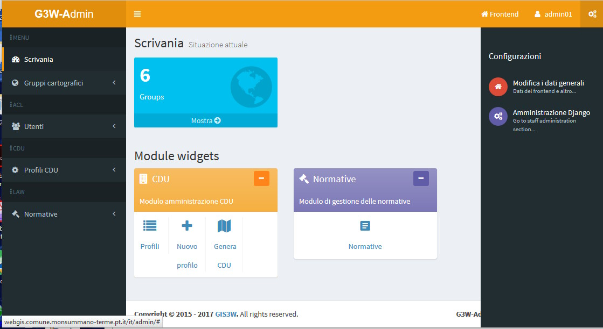

In the **`General suite data`** form you can define all the informations that will appear on the portal home page
 * **`Home data`:** info that will appear on the front end landing page
 * **`About data`:** info that will appear in the **About it** session
 * **`Group map data`:** info that will appear in the **Maps** session
 * **`Login data`:** info that will appear in the **Login/Administration** session
 * **`Social media data`:** links to the social channels that will appear in the **About it** it session
 * **`Map Client data`:** main title to be displayed in the cartographic client bar
 
### Front End Home Data
Informations that will appear on the front end landing page

**ATTENTION:** contents marked with * are mandatory.

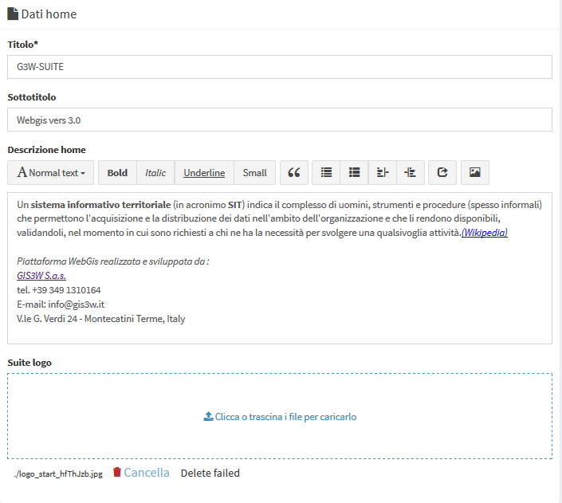

### Front End About Data
Informations that will appear in the **Info** session

**ATTENTION:** contents marked with * are mandatory.

### Frontend Groups Map Data
Information that will be displayed in the **Maps** session

**ATTENTION:** contents marked with * are mandatory.

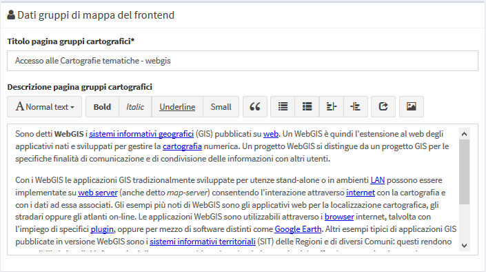

### Front End Login Data
Information that will be displayed in the **Login/Administration** session

**ATTENTION:** contents marked with * are mandatory.

### Front End Social Data
Links to the social channels that will be displayed in the **About it** it session

**ATTENTION:** contents marked with * are mandatory.

### Map client data
Main title to be displayed in the cartographic client bar

In the **Credits** subsection it is possible to define additional text for the publishing aspects.

After filling in the various form, click on the **Save button** to confirm your choices.

## Users and Users Groups management
In the left side menu there is the **Users** item with four sub-items:
 * **Add user**
 * **Users list**
 * **Add groups users**
 * **Groups users list**
 
### Add user
Through this form it is possible to insert new users and define their characteristics.

 * **`Anagraphic`**: first name, last name and email address
 * **`Login`**: username and password
 * **`User backend`**
 * **`ACL/Roles`**
   * **Superuser status** (Admin1 and Admin2 users only)
   * **Staff status**: deep administration of the application (Admin1 users only)
   * Main roles (**Editor1, Editor2 or Viewer**)
   * **User Editor groups**: any Editor2 user group they belong to
   * **User Viewer groups**: any Viewer user group they belong to
 * **`User data`**:
   * Departments and image to be associated with the profile

After filling in the various form, click on the Save button to confirm your choices.

### Users list
Through this form you can consult the list of enabled users and their characteristics:
 * Username
 * Roles
 * User groups to which they belong
 * Associated Cartographic MacroGroups (only for Editor1 users)
 * Super user and/or Staff privileges
 * Email, name and surname
 * Creation date
 * Info on user creation (G3W-SUITE or LDAP)
 
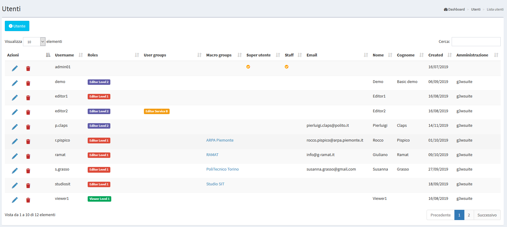

The icons at the head of each row, allow you to:
 * 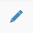 **Modify:** to modify the characteristics of the user
 *  **Delete:** to permanently delete a user
 
### Add Group Users
Through this form it is possible to insert new user groups and define their role.

It is possible to create only two types of user groups:
 * **`Editor`:** in which only Editor2 users can be inserted
 * **`Viewer`:** in which only Viewer users can be inserted

The association between user and user groups is made at the individual user management level.

In the specific form for creating user groups, the following info are defined:
 * **Name**
 * **Role** (Editor or Viewer)
 

 
After filling in the from, click on the **Save** button to confirm your choices.

### Groups users list
Through this form it is possible to consult the list of enabled user groups, their characteristics and the individual users belonging to the group.

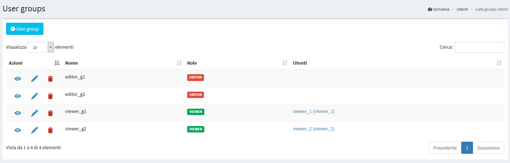

Using the icons at the head of each row, you can:
 *  **Show details:** to consult the characteristics of the user group 
 *  **Modify:** to modify the characteristics of the group 
 *  **Delete:** to permanently delete a group and therefore association with users belonging to the group itself 

## Macro Cartographic Groups
In this section it is possible to view the list of Cartographic Macrogroups, manage them and create new ones.

**ATTENTION: use the Cartographic MacroGroups only if you need them.**

See chapter [Hierarchical organization of WebGis services and types of Users](https://g3w-suite.readthedocs.io/en/3.2.x/user_groups_organization.html#hierarchical-organization-of-webgis-services-and-types-of-users-roles) to learn more about this aspect.

For example, you can create a **Macrogroup** to collect a series of **Cartographic Groups** belonging to the same Administration (single Municipality within a Union of Municipalities) or more simply to have main containers that contain second level groupings (Groups).

In the left side menu there is the **MacroGroup Cartographic** item with two sub-items:
 * **Add MacroGroups:** to create a new Cartographic MacroGroup
 * **MacroGroups list:** to access the list of MacroGroups present
 
### Add MacroGroups
Through this item, available only for the **Admin** users, it will be possible to **create a new Cartographic MacroGroup and associate it with an Editor1 type user who will become its administrator**.

Let's see in detail the various sub-sessions of the group creation form.

#### ACL users
**`Editor users`:** you define the **Editor1 user** who will become the **MacroGroup administrator**. This user will can manage the MacroGroup by creating Cartographic Groups, publishing projects and creating Users or User Groups.

#### General data
 * **`Identification name *`:** a generic internal identification name (not show in the front end)
 * **`Title *`:** descriptive title of the MacroGroup (will appear in the list of MacroGroups) and, eventually, in the client header
   * **Use title for client** option
   * **Use logo image for client** option
 * **`Description`:** the description to be associated with the MacroGroup in the frontend
 * **`Logo img*`:** the logo to be associated with the MacroGroup in the frontend and, eventually, in the client header

By default, the map client header, for each WebGis service, is composed of:
 * main title (if set at General Data management level)
 * logo and title associated with the **Cartographic Group**
 * title of the WebGis service

If you select the **Use MacroGroup title and logo for the client** options, the map client header, for each WebGis service, will instead consist of:
 * main title (if set at General Data management level)
 * logo and title associated with the **Cartographic MacroGroup**
 * title of the WebGis service

After compiling the form, click on the **Save button** to confirm your choices.

### MacroGroups list
The menu provides access to the list of cartographic macro-groups present.

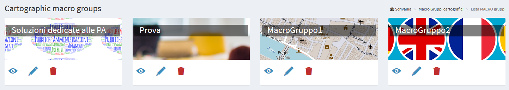

There are a series of icons to access specific functions:
 *  **Show the details** of the MacroGroup
 *  **Change** characteristics of the MacroGroup
 *  **Delete** MacroGroup

**ATTENTION:** the removal of the Cartographic MacroGroup group will result in:
 * the **removal of all the Cartoghraphic Groups** contained in it
 * the **removal of all the cartographic projects** contained in the individual Groups
 * the **removal of all the widgets** (eg searches) that would remain orphaned after the removal of the cartographic projects contained in the group. See the Widget chapter for more information.

#### Define the MacroGroups order on the FrontEnd
Through the Drag & Drop function it is possible to define the order of the MacroGroups in the list. This order will be reflected in the FronEnd.

## Cartographic Groups
_**In this section it is possible to view the list of Cartographic Groups present, manage them and create new ones.**_

A Cartographic Group is create  to **collect a series of cartographic projects belonging, for example, to the same theme** (Urban Planning Regulations, tourist maps ...) and characterized by the same projection system.

It should be remembered that it will be possible to switch from one webgis service to another, leaving the same geographical extension and scale, only between the projects contained in the same cartographic group.

In the left side menu there is the **Cartographic Groups** item with two sub-items:
 * **Add Group:** to create a new Cartographic Group
 * **Group List:** to access the list of groups present

You can also access the list of groups by clicking on the **"Show"** button in the **Cartographic Groups** box on the **Dashboard**.

### Add Group
**Through this item it is possible to create a new Cartographic Group.**

During creation, some functional characteristics and tools that the WebGis interface will show for all cartographic projects published within the group are also defined.

Let's see in detail the various sub-sessions of the group creation form.

#### General data
 * **`Name *`:** a generic internal identification name (not show in the front end)
 * **`Title`***: descriptive title of the Group (will appear in the list of Cartographic Groups)
 * **`Description`**: description of the content
 * **`Language`***: interface language
 
#### Logo/Picture
 * **`Header logo img`***: the logo to be displayed in the header del client cartografico
 * **`Use logo image for client`** option
 * **`Logo link`:** a eventual link to associate with the logo
 
 **REMEBER**
 
By default, the map client header, for each WebGis service, is composed of:
 * main title (if set at General Data management level)
 * logo and title associated with the **Cartographic Group**
 * title of the WebGis service

If you select the **Use MacroGroup title and logo for the client** options, the map client header, for each WebGis service, will instead consist of:
 * main title (if set at General Data management level)
 * logo and title associated with the **Cartographic MacroGroup**
 * title of the WebGis service
 
 If you select the **Use Group logo for the client** options, the map client header, for each WebGis service, will instead consist of:
 * main title (if set at General Data management level)
 * title associated with the **Cartographic MacroGroup**
 * logo associated with the **Cartographic Group** (if MacroGroup logo option is active this options takes precendence)
 * title of the WebGis service
     
#### ACL Users
**Access and modification powers are managed.**

The options present will vary according to the type of user (Admin or Editor1) who creates/manages the Group
 * **`Editor1 User`:** defines the **user (Editor1) manager of the Group**.
     The entry is present only when the Admin type user creates the Group
     If the Group is created by a user of type Editor1, the Group is associated directly with that user
 * **`Editor2 User`:** defines the **user (Editor2) manager of the Group**.
 * **`Viewers users`:** define the individual **users (Viewers) who have the credentials to view the contents of the group**. By choosing the anonymous user (AnonymusUser) the group will be free to access
 * **`Editor user groups`:** define the **user groups (Editor2) who manage the Group**.
 * **`Viewer user groups`:** you define the **user groups (Viewer) which have the credentials to view the contents of the group**.

The option **`Propagate viewers user (single and groups) permissions`** allows you to propagate the Viewer users (individuals and/or groups) associated to the Group to ALL the WebGis services present in it. 

**This option cancels any differentiation in the access policies applied to the WebGis services contained in the Group.**

#### MacroGroups
**Possible definition of the belonging MacroGroup.**

This option is available only if Cartographic macro groups have been created

In the event that the Group is created by an Editor1 type user, the Group will be automatically associated with the MacroGroup associated with the same Editor1.

#### GEO data
**Projection system associated with the group.**

**N.B.** All projects loaded into the group must be associated with this SRID.

#### Base layers and Map default features
In this box you can define:
 * **`Mapcontrols`***: list of tools available on the WebGis client:
   * **zoomtoextent:** zoom to the initial extension
   * **zoom:** zoom in and zoom out
   * **zoombox:** zoom tool based on drawing a rectangle
   * **query:** puntual query of geographical layers
   * **querybbox:** query via bounding box (**N.B. for the layers to be queried according to this method it is necessary that they are published as WFS services on the QGIS project**)
   * **querybypolygon:** it will be possible to automatically query the features of one or more layers that fall inside a polygonal element of a guide layer. (Eg what's inside a cadastral parcel?). - **N.B. searchable layers must be published as WFS services on the QGIS project**
   * **overview:** presence of a panoramic map
   * **scaleline:** presence of the scale bar
   * **scale:** tool for defining the display scale
   * **mouseposition:** display of mouse position coordinates
   * **geolocation:** geolocation tool  (available only with https certificate)
   * **nominatin:** address search tools and toponyms based on OSM
   * **streetview:** Google StreetView on your map (available only with GoogleMaps API Key)
   * **length:** linear measuring instrument
   * **area:** surface measuring instrument
   * **addlayers:** tool for temporarily uploading GeoJson, KML and SHP (zipped) vector layers to WebGis
   * **screenshot:** tool to take a screenshot of the map area
 * **`Baselayer`:** choice of the base maps that will be available on the WebGis client
 * **`Background color`:** choice of the background color of the maps (default white)
 
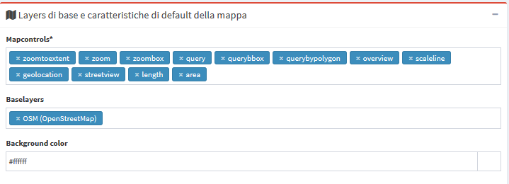

With regard to the **Base Layers**, it is specified that the external services available by default are:
 * **OSM**
 * **Bing Street**
 * **Bing Aerial**

It is possible to create/add **customized Base Layers** starting from the cache of the single layers present in published webgis

See **Caching layer** paragraph in the **Widget management** session.

#### Copyrigth
**`Terms of use`:** description of the terms of use of the map and any other info
**`Link to terms`:** link to text

After filling in the various form, click on the **Save** button to confirm your choices.
 

### Groups List
**From this item you can access the list of the created cartographic groups.**

For each group, the Title and Subtitle defined at the time of creation are shown.

There are also a series of icons to access specific functions:
 *  **Add a new project** to be published on the WebGis service
 * Number and links to projects published within the Group
 *  **Show group details**
 *  **Change** group characteristics
 *  **Delete** group

**ATTENTION:** the removal of the cartographic group will involve:
 * the **removal of all the WebGis services** contained therein
 * the **removal of all widgets** (eg searches) that would be orphaned after the removal of the WebGis services contained in the group. See the Widget chapter for more information.

A large **+ icon** is available to access the form for creating a new group.

#### Define the Groups order on the FrontEnd
Using the Drag & Drop function it is possible to define the order of the Groups in the list.

This order will be reflected within the belonging MacroGroups.

**NB:** currently in the list of Groups it is not present in the subdivision in the belonging MacroGroups but the fact that a Group can be associated with only one MacroGroup still allows you to manage intuitively what will be the complessive display order.

## Publication of new WebGis services
### To publish a new QGIS cartographic project
It is possible to publish new QGIS projects:
 * **from the list of cartographic groups:** click on the icon  located under the box of the cartographic group in which you want to publish the project.
 * **from the list of cartographic projects published within a group:** by clicking on the the buttom 

In the dedicated form we could define the charatteristicsof the project being published:

#### QGIS project
**`QGIS file`***: load the QGIS cartographic project to be published (.qgz or .qgs file)

#### ACL Users
**Management of access and/or modification permissions**

The options present will vary according to the type of user (Admin, Editor1 or Editor2) who creates / manages the WebGis service.
 * **`Editor1 user`:** defines the **user (Editor1) manager of the WebGis service**.

The entry is present only when the WebGis service is created by Admin or Editor1 user.

In the event that the WebGis service is published by a user of type Editor1, the WebGis service is associated directly with that user
 * **`Editor2 User`:** defines the **user (Editor2) manager of the WebGis service**.
 
   The item is present only when the user of the Admin or Editor1 type creates the service
 WebGis. 
   In the event that the WebGis service is published by a user of type Editor2, the WebGis service is associated directly with that user

 * **`Viewers users`:** define the individual **users (Viewers) who have the credentials to view the WebGis service**. By choosing the anonymous user (**AnonymusUser**) the group will be freely accessible.
 * **`Editor user groups`:** define the **user groups (Editor2) who manage the service**.
 * **`Viewer user groups`:** you define the **user groups (Viewer) which have the credentials to view the content of the service**.

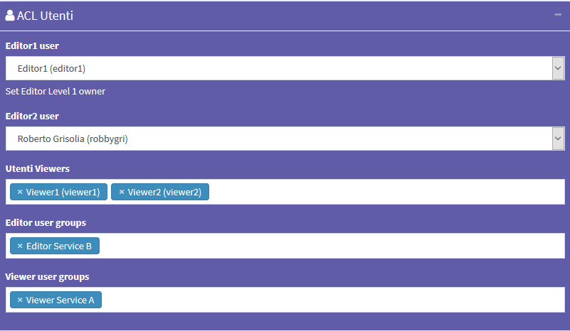

#### Default base layer
**In this session you define which base layer should be active at startup.**

The choice is limited to the list of base layers activated for the cartographic group in which you work.

It is also possible not to define any active base layer at startup.

#### Description data
 * **`Public title`:** title of the WebGis service, it will appear at the font end level and in the header of the client.
 * **`Description`:** Description of the project, it will appear at the public portal level.
 * **`Thumbnail (Logo)`:** logo to associate with the project. This image will be viewable in the list of projects within the cartographic group
 * **`URL alias`:** a human readable URL for the map. Only alphanumeric characters, not white space or special characters.

The title associated with the WebGis service follows this definition logic:
 * Public title: if set
 * QGIS project title: if set on the **General session** of **QGIS project properties**
 * Name of the QGIS project file

#### Options and actions

 * **`User QGIS project map start extent as webgis init extent`**: check this control if you want set initial extent from QGSI project initial extent
 
Otherwise the initial extension will correspond to the maximum one defined on the basis of the extension associated with the WMS capabilities of the QGIS project (**Project properties -> QGIS Server -> WMS capabilities (Advertised extent)**)

 * **`Tab's TOC active as default`**: set tab's TOC (Layers, Base layers, Legend) open by default on startup of webgis service
 
 * **`Automatic zoom to query result features`**: if in the results of a search there are only features of a layer, the webgis automatic zoom on their extension
 
The next options allow you to define the type of WMS / WFS query to be carried out and the maximum number of results obtainable following a query.
 * **`Max feature to get for query`***: max number of feature to get for single or multiple mode
 * **`Query control mode`***: single or multiple
 * **`Query by bbox control mode`***: single or multiple
 * **`Query by polygon control mode`***: single or multiple

**ATTENTION:** contents marked with * are mandatory.

After filling in the various form, click on the Save button to confirm your choices.

**If the operation is successful we will see the new project appear in the list of projects in in the working Cartographic Group.**

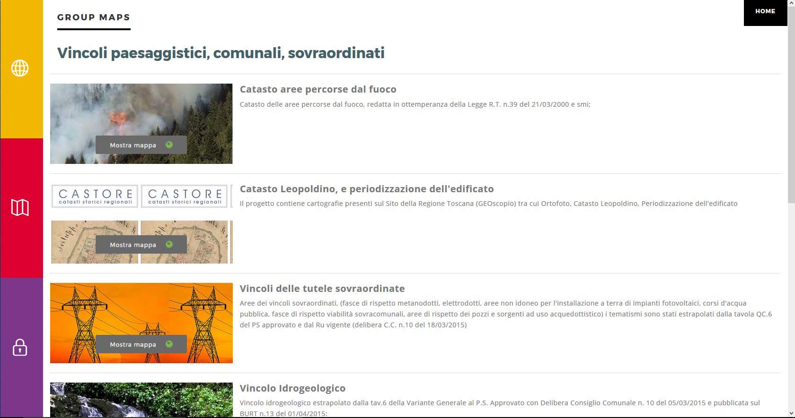

### Define the Groups order on the FrontEnd
The individual WebGis services will be arranged, within the Thematic Groups to which they belong, in alphabetical order based on the title of the service.

## Update/ Manage WebGis services
To **update** a published WebGis service, access the list of projects in the Cartographic Group.

Click on the **Edit**  icon placed at the top of the WebGis service and reload the QGIS file with the changes made in the relevant form.

Click on the **SAVE** button to confirm the change.

Always starting from the list of WebGis services, it is possible to manage numerous functional aspects associated with them.

### Basic tools

**In this section it is therefore possible to view the list of cartographic projects present, view them, manage them and create new ones.**

Through the single icons, placed at the level of each project, it is possible to:
 *  **Display the cartographic project on the WebGis interface:** to check the display by the user
 *  **Access the list of layers** present within the project and define their functional aspects
 *  **View the project specifications**
  *  **Test the WMS Capabilities** of the project
 *  **Update a project:** update of the QGIS file and other options related to the project
 *  **Remove a cartographic project**
   **Warning:** removing a project also removes all the widgets (e.g. searches) that would be orphaned after the project has been removed
 *  **Download of the QGIS project**
 *  **List of OGC services** associated with the project

### Setting up the overview map for WebGis services
In this session it is also possible to define which of the cartographic projects loaded within the group will be used as a panoramic map.

To set the panoramic map, choose the projects and tick the check box in the **`Overview`** column.

## Widget management
Once a cartographic project has been published, thougth the icon  it is possible to access the list of the geographical states that compose it and define some functional aspects that will be enabled at the cartographic client level.

Next to each layer are a series of icons and checkboxes:
 * **Label:** layer alias applied at the QGIS project level
 * **Name:** name of the layer (file or DB table)
 *  **Type:** illustrates the type of data (WMS, PostGis, SpatiaLite, GDAL / OGR ...)
 * **WMS external:** to speed up loading, the WMS layers present in a QGIS project are managed directly by Django and not by QGIS-Server. However, this method prevents the application of any styling  (e.g. opacity level) defined at the project level. The choice of the external WMS option means that the WMS layer is managed directly by QGIS-Server and therefore the associated styling is applied.
 * **WFS:** a check mark shows whether the layer is published as a WFS service or not
 * **Actions:** a series of icons dedicated to various functions
   *  **Caching Layer:** allows you to activate and manage the cache of the single layer at the project level
   *  **Editing layer:** shows if the online editing function is active on the layer and allows you to activate and define it
   *  **Manage alphanumric constraints:** create or manage editing and visualization alphanumeric-constraints
   *  **Manage geo-contsraints:** create or manage editing geo-constraints
   *  **QPlotly widget:** add or manage plots created with DataPlotly QGIS plugin
   *  **List of widgets:** shows how many widgets (eg searches) are associated with this layer and allows you to activate new ones
   *  **Manage layer styles:** manage multi-style layer
 * **No legend:** it allows to define if the layer must have published the legend at TOC level of the WebGis client
 * **Download:** allows the download of the geographic and not geographic layers in various formats
   * **Download as shp:** for geographic (shp) or not geographic (dbf) layers
   * **Download as GPK:** for geographic or not geographic layers
   * **Download as xls:** for all types of layers, in .xls format
   * **Download as csv:** for all types of layers, in .csv format
   * **Download as gpx:** for geographic layers, in .gpx format

**The number above each Action icon shows if and how many related objects are present.**

The functions present in the **Actions session** are described below.

###  Editing layer

Through this icon it is possible to activate the online editing function on the individual layers and define the permissions for individual / groups of users

See the dedicated paragraph in the [Editing on line session](https://g3w-suite.readthedocs.io/en/3.2.x/g3wsuite_editing.html).

###   Display and editing constraints

Through the **Manage geo-contsraints** and **Manage alphanumric constraints** widgets it is possible to define editing and display filters for users authorized to consult/edit the project.

See the dedicated paragraph in the [Editing on line session](https://g3w-suite.readthedocs.io/it/3.2.x/g3wsuite_editing.html#constraints-setting).

###  Caching layer (Base Map)

With this icon it is possible to **activate/manage the cache of the single layers** and **create XYZ Tiles layer**

The form allows you to:
 * **enable cache** on the layer
 * **reset the cache of the single layer**
 * **reset the cache of all the layers of the project**
 * **create an XYZ Tiles layer** (to use as a **base layer** for your projects) starting from the cached layer

In this last case you have to set:
 * Base layer title
 * Base layer description
 * Base layer attribution

The newly created base layer will be available to be associated with those available for the various Cartographic Groups.

###  Plots from DataPlotly QGIS plugin

**View plots created using QGIS [DataPlotly](https://github.com/ghtmtt/DataPlotly) (a great plugin developed by [Matteo Ghetta](https://github.com/ghtmtt)) in the cartographic client.**

The module, based on the [Plotly library](https://plotly.com/), manages **plots saved as xml**.

The plots are connected to the layers defined on the QGIS project, in this way, as for the searches and the constraints, it is possible to activate  (checkink the **Linked** checkbox) the same plots on all WebGis services in which the reference layer is present.

It is also possible:
 * download the plot XML file to reuse it in QGIS
 * define the activation status of the plots when the WebGis service is started

The title of the chart, defined at the plugin level, will be the unique identifier.

It will be possible to **filter plots based on the geometries visible on the map and/or selected by the user**.

###  Manage layer styles

If **multi styles have been associated with the same layer** in the QGIS project, they will be exposed.

It will be possible to associate new layers by **loading related QML files** and **set the style to be used as default**.

###  Search widget setting
In G3W-SUITE it is possible to create search widgets.

By default, searches can be built on individual vector layers based on the fields of the table associated with the layer.

**NB: it is possible to create searches based on fields derived from simple joins (1:1/n:1) switching form WMS to QGIS API method.
See [dedicated paragraph](https://g3w-suite.readthedocs.io/en/3.2.x/settings.html#g3w-client-search-endpoint).**

Every search widget will be saved by referring to the layer identifiers (for example the DB parameters: IP, DB name, schema, layer name).

This aspect allows, once a search widget for a layer has been created, to have it available on all the projects in which the layer is present, without having to rebuild the widget from scratch each time.

In the list of layers present within the project, **identify the layer on which to create and associate the search widget** and click on the icon 

By clicking on the icon, the list of already active (or activatable) widgets associated with the layer will be shown.

These widgets can be **modified, deleted or disconnected** using the appropriate icons.

**ATTENTION: deleting a search** will delete it from all projects in which that search is active.

To **deactivate a search** from a project, simply disconnect it using the check-box on the right.

To **create a new search**, click on the link **`New widget`**.

In the pop-up that appears, the **`Search` type** have to be chosen.

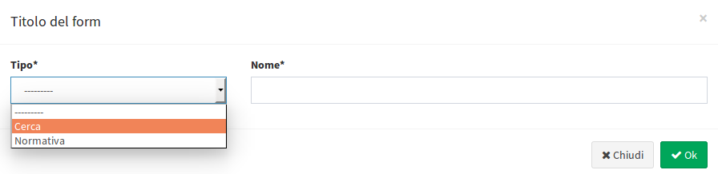

In the related form we can define:
 * **Form Title**
   * **`Type`:** "Search"
   * **`Name`:** name that G3W-SUITE will use to internally register the search widget.
 * **General configuration of research and results**
   * **`Search title`:** title that will become available in the **'Research'** panel of the WebGis interface
 * **Search fields settings**
   * **`Field`:** field on which to carry out the research
   * **`Widget`:** method of entering the value to be searched
             `InputBox`: manual compilation
             `SelectBox`: values ​​shown via drop-down menu
             `AutoCompleteBox`: values ​​shown through auto-complete mode
   * **`Alias`:** alias assigned to the field that will appear in the search form
   * **`Description`:** description assigned to the field
   * **`Comparison operator`:** comparison operator (**=, <,>,> <,> =, <=, LIKE, ILIKE**) through which the search query will be carried out.
   * **`Dependency`:** this parameter (optional) allows, only in the case of SelectBox widgets, to list the list of values ​​of a field filtered according to the value defined for the previous fields. The tool allows, for example, to display, in the drop-down menu dedicated to the choice of cadastral particles, only the particles connected to the sheet chosen in the previous option. This function is only available for PostGis or SpatiaLite layers.

**Warning: in the case of fields with more than 100 unique values, the WMS service does not allow to obtain the complete list of values. In this case it is recommended not to use the `SelectBox` method**

**Alternatively, you can use the QGIS API as a search method to overcome this limitation. See [dedicated paragraph](https://g3w-suite.readthedocs.io/en/3.2.x/settings.html#g3w-client-search-endpoint).**

The button  allows you to add additional fields for the construction of the search query currently manageable through **AND/OR operators**.

The example below shows the compilation of the form for creating a search widget dedicated to a cadastral cartography layer.

Once the form has been filled in, click on the OK button to save the settings.

Once the settings are saved, the created widget will appear in the list of Widgets associated with the layer.

The widget will already be **`connected`** and therefore **available in the WebGis interface**.

**IMPORTANT:** the created search widget will now be available (disconnected) for all projects in which the layer with which it has been associated will be present.

**This will allow you not to have to recreate the widget several times and to decide in which projects to activate the search and in which not.**

## Multilinguage
y default the suite manages four languages: 
 * English
 * Italian
 * Finnish
 * Swedish

Other languages ​​can be added.

### Map client
On the top bar you can choose, through a drop-down menu, the language of the entire client interface.

### Administration
Also for the Administration panel, through the same drop-down menu, it is possible to define the language of the entire interface of the console.

### Front end
Fixed front end content is already available in the four basic languages.

Variable contents, i.e. user-definable contents, are instead translated:

 * Sessions **`Home`**, **`About`**, **`Maps`** and **`Login`**: content that can be defined and translated in the [**Edit General Data**](https://g3w-suite.readthedocs.io/en/3.2.x/g3wsuite_administration.html#front-end-portal-customization) session of the Control Panel Administration
 * Sessions **`MacroGroups Cartogarfici`**, **`Groups Cartogarfici`** and **`WebGis Services`**: contents definable and translatable in the form defining these elements, limited to the items:
   * **Public Title**
   * **Description**

To carry out the translation of these contents, proceed as follows:
 * access to the form for creating the element (**MacroGroup, Group or WebGis Service**)
 * define one of the available languages from the drop-down menu at the top right
 * fill in the form in the chosen language
 * save the settings

Then:
 * access the form again in modification
 * change the language
 * fill in the translatable content in the new language
 * save the new settings
 
 **Titles and Descriptions of the various elements in the defined languages ​​will be available on the front.**
