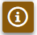
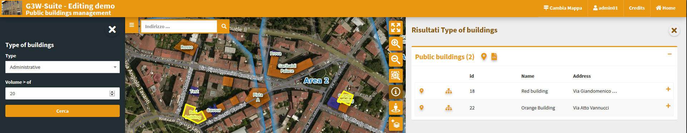

# G3W-CLIENT: the cartographic client
## Generic aspects

The application has a responsive interface consisting of expandable and reducible sessions.

The color of the interface depends on the type of user logged in.

**`The header`** contains the following elements:
 * **Logo, title and subtitle**, deriving from:
   * main title (set at General Data level) or MacroGroup name, according to the settings
   * Cartographic Group name
   * WebGis service title
 * **Change map:** which allows you to switch from one WebGis service to another (located within the same Cartographic Group) while maintaining extension and display scale
 * **User ID:** if you have logged in to the system
 * **Credits**
 * **Home:** to access the FrontEnd
 * **Language:** the choice of language is reflected in the individual menus of the map client and on the contents of the access portal. The languages available are those activated by the Administration. 

The **`Tools panel`** is located on the left and containing the following objects:
 * **Metadata:** content defined on QGIS project
 * **Print:** printing tool based on the layouts defined on the QGIS project
 * **Search:** with the search tools defined through the Administration panel
 * **Tools:** session that collects the various tools that may be activated on the WebGis service
 * **WMS:** session to add custom WMS services to the map
 * **Map:** containing:
   * **Layers:** structured list of layers, defined on the QGIS project
   * **Base:** choice of the base map from those defined at the creation level of the Thematic Group
   * **Legend:** graphic legend of the various layers

In the event that **Themes (Views) are defined in the QGIS project**, a specific choice menu will be available in the Layers session of the TOC.

The choice of a Theme will determine the **automatic activation of the layers and related styles**, defined in the Theme itself.

## Navigation and interaction with the map

### Map area

At the base of the map area there is an information bar showing:
 * **display scale**
 * **mouse coordinates**
 * **project projection system**
 * **icon to copy the URL with the references to the extension currently displayed**
 

 
### Map controls

**The icons and description of the functions of the various **`MapControls`** activated at the thematic group level are shown below.**

 *  **`zoomtoextent`:** zoom to the initial extension
 *  **`zoom`:** zoom in and zoom out
 *  **`zoombox`:** zoom tool based on drawing a rectangle
 *  **`query`:** puntual query of geographical layers
 *  **`querybbox`:** query via bounding box - **N.B.** for the layers to be queried according to this method it is necessary that they are published as WFS services on the QGIS project
 *  **`querybypolygon`:** it will be possible to automatically query the features of one or more layers that fall within a polygonal element of a guide layer. (Eg what's inside a cadastral parcel?). - **N.B.** the questionable layers must be published as WFS services on the QGIS project
 *  **`geolocation`:** geolocation tool (useful for consultation from tablet)
 *  **`nominatin`:** search tools for addresses and toponyms based on OSM
 *  **`streetview`:** Google StreetView on your map
 *  **`length`:** linear measuring instrument
 *  **`area`:** tool for measuring surfaces
 *  **`addlayers`:** tool for temporarily uploading GML, GeoJson, KML, GPX, SHP (zipped) and CSV with coordinate to WebGis. These layers will remain until the end of the work session
 *  **`snapshot`:** tool for taking snapshots of the map area
 *  **`GeoSnapshot`:** tool to export a GeoTIFF of the map area

**Query type**

It should be noted that the query function acts, by default, with the coring method, providing information relating to all the layers underlying the point where you click with the mouse or draw a box.

To query a single layer, it must be previously selected at the TOC level.

Remember that query modes based on **querybbox** and **querybypolygon** require the publication of all the layers involved as WFS services at the QGIS project level.

**NB:** Remember that, after viewing the results, it will be possible to zoom on the feature associated with the individual results only if the option **`Add geometry to object response`** has been activated at the QGIS project level (**`Project → Properties, QGIS Server session`**).

### Map query

In the QGIS project (**`Vector properties → Attributes Form`**), you can create custom attribute forms (tabs, groups ...)

Upon querying a geometry, the form structure will be replicated at the client level.

Any links to photos will determine the display of a clickable preview, any links to links or other multimedia content will determine the display of the Open button that will allow consultation of the link.

For further information on this point, see the [**dedicated paragraph**](https://g3w-suite.readthedocs.io/en/v.3.4.x/projectsettings.html#viewing-multimedia-content).

#### Single result

In case the query provides one single result, the attributes will be displayed according to the form defined in the QGIS project or as a column list

 

The bar above the query results shows the following icons:

 * **Zoom to feature:** if the function is activated on the Properties of the QGIS project
 * **Show relations (1: N):** if present on the QGIS project
 * **Show relation charts:** display of plots related to 1: N related data. Only if 1: N relationships are associated with the interrogated layer and plots have been activated on the referencing tables.
 * **Print Atlas:** prints the reports (atlas) (if set on QGIS project) related to the queried feature
 * **Download single results (Shapefile, GPK, GPX, CSV, XLS):** if activated in the administration session
 * **Remove feature from result:** remove the feature to the current list of results (useful to choose manually the list of objects to select/download)
 * **Add/Remove selection:** add/remove the features to the current selection
 * **Copy map URL pointing to the geometry :** to create a parameterized URL that points to this features
 * **Editing:** to start editing directly on this feature
 

#### Multiple result

In case the query provides more results these will be listed as a list with the possibility to expand the detailed information.

A series of icons, relating to the list of resulting features, will allow you to:
 

 * **Zoom to features result extent:** if the function is activated on the Properties of the QGIS project
 * **Print Atlas:** prints the reports (atlas) (if set on QGIS project) related to all the features result
 * **Download all the features results (Shapefile, GPK, GPX, CSV, XLS):** if activated in the administration session
 * **Add feature on result:** add features (clicking on the map) to the current list of results (useful to choose manually the list of objects to select/download)
 * **Add/Remove selection:** add/remove the list of features result to the current selection
 

### Display of 1:n relation data

In the event that, at the QGIS project level, **one or more type 1:n relations** have been associated with a layer, the icon **View Relationships**  will be shown in the attribute form.

By clicking on the icon you will access the **list of 1:N relations** present and, from these, the list of child records associated with the individual relationships. 

In the case of a **simple 1:1 or N:1 joins**, the joined records will be displayed directly in the main form.

In the new frame, a filter, applied generically to the contents of all fields, will allow you to filter the list of child records.

The icon to the left of each record allows you to switch from the classic table view to the one based on any form defined on the QGIS project

In the case of **links to multimedia contents**, the previews of the images and/or the **`Open` button** will be displayed for consultation of different types of content.

In case of **active plots** on the related table, these will be displayed through **`Show charts`** at the top right.

### Parameterized URLs

**It is possible to create parameterized URLs for direct zomming to:**
geographical extension 
single feature by FID 
single/list features by value of a field 

Here the URL paramters available:
 * **map_extent (Zoom to map extent)**
   * Ex: <url_project>?map_extent=Xmin, Ymin,Xmax,Ymax
 * **zoom_to_fid (Zoom to a specific feature by FID)**
   * Ex: <url_project>?zoom_to_fid=<layer_id>|<fid value>
 * **ztf (Zoom to features defined on the basis of attribute values)**
   * Ex: <url_project>?ztf=<layer_id or layer name>:<field name>=<field value>

## Tools panel
### Metadata
The metadata reported in this session derive from those set at the QGIS project level.

This content is divided into three sessions: **General, Space Info and Layers.**
 * **`General`:** reports the **metadata defined on the QGIS project** in the item: **`Project →  Properties (QGIS Server session, Service Capabilities)`**
   In case of login as anonymous user the URL of the WMS service is shown.
 * **`Spatial`:** reports the **EPSG code** of the projection system associated with the QGIS project and the **BoundingBox** relating to the initial publication extension, defined in the item: **`Project →  Properties (QGIS Server session, WMS Capabilities, Advertised extent)`**
 * **`Layers`:** reports **simple metadata associated with the individual layers**.

### Charts
**View graphs created using QGIS [DataPlotly](https://github.com/ghtmtt/DataPlotly) and activated at the admin session level.**

Check the plots in the list and consult them on the rigth panel.

The graphs are filterable based on the:
 *  features visible on the map
 *  filter based on the selected features
 
These **filters** are also **reflected on the plots associated to the related data** (in 1:N mode) based on the visible and/or selected parent features.

The **filter based on the map content** can be activated globally on all plots (icon at the top of the panel dedicated to charts) or on only some specific plots (icon placed at the level of the individual plots).

The plots will automatically update after pan and zoom operations on the map

If activated, the **filter based on the selected features** is automatically activated on all related plots (associated with the same layer and with the 1:N relationed tables)

Appropriate **messages** at the single plots level will indicate the activation of these filters.

#### Charts based on 1:N data relation (child layer)

If the **chart is linked to a child layer in a 1:N relation**, it can also be displayed at the information level of the individual parent features

### Print
**Printing tool based on layouts defined on QGIS project.**

The tool allows you to choose:
 * **Template:** print layout among those associated with the published QGIS project
 * **Scale:** print scale
 * **DPI:** print resolution
 * **Rotation:** rotation angle
 * **Format:** print to PDF or JPEG
 * **Custom title:** using the **ItemIDs** at the print layout level of the QGIS project it is possible to insert one or more labels with **customized content in the print** from WebGis

On the map, a light rectangular area will allow you to define the print area.

If an **Atlas type print layout** is associated in the QGIS project, the layout reference will be available.
The cards to be printed are defined by referring to the atlas identifier defined in the print layout.

### WMS
**Through this tool the user can add custom WMS layers to the WebGis service.**

The user can add one or more WMS URL and, for each of them, define:
 * the position (top or buttom) with respect to the other layers of the project
 * the layer to load
 * the projection system to be associated
 * a custom name

When the first custom WMS is added, a new tab (WMS) appears in the TOC; here you can switch on/off or delete the individual added WMS layers.

The added WMS layer cannot not be queried.

The list of WMS services and the specific WMS layers added will remain available to the user until the browser cache is cleared.

### Search and Query Builder

A classic Query Builder is present at the Search menu level.
Through this tool it is possible to:
 * carry out alphanumeric searches on geometric layers
 * save the query to reuse it until the end of the work session
 * edit a previously saved query
 
The saved query will be available until the browser cache is cleared

**The Search menu contains the list of search tools defined through the Administration panel and custom searches created with the Query Builder.**

You choose the search you are interested in, fill in the required fields and click on the **`Search` button**.

The **panel with the list of results** will open on the right side of the client, for each result the first three fields of the associated table will be displayed.

By positioning on the individual results, the corresponding features will be highlighted on the map; clicking on the individual results you can consult all the attributes.

Zoom to features and download icons are available for results (single or cumulative)

### Map

This session has three tabs:
 * **Layers:** structured list of layers, defined on the QGIS project
 * **Base:** choice of the base map from those defined at the Cartographic Group creation level
 * **Legend:** graphic legend
 
#### Layers
 
In the list of layers, right click on the name of the single layer shows the following items:
 * **Name and kind of geometry** of the layer
 * **Styles:** to choose the style to be applied to the layer, in the case of multi-style layers
 * **Abstract:**  a text (also html) defined in the **Layer Properties**, **Metadata** session, **Identification** tab, **Abstract** form.
 * **Zoom to layer:** to zoom in on the extension of the layer
 * **Open attribute table:** to consult the associated attribute table
 * **Download shapefile:** to download the layer as a shapefile; function activatable from the administration panel
 * **Download GEOTIFF:** to download a raster in GeoTiff format, full layer or clipped to the extent of the canvas; function activatable from the administration panel  
 * **Download GeoPackage:** to download the layer as a GeoPackage; function activatable from the administration panel
 * **Download CSV:** to download the layer as a CSV; function activatable from the administration panel
 * **Download XLS:** to download the layer as a XLS; function activatable from the administration panel
 * **WMS URL:** URL of the WMS service relative to the project or URL of the external WMS

It is possible to hide, automatically, layers from the TOC when they have no records. 

Useful when using filters on layers or geographic views. 

##### Attribute table

The attribute table (resizable) is equipped with **paging function, highligth function and zooming** to the associated features.

In the case of links to **multimedia content**, the previews of the images and/or the **Open** button will be displayed for consultation of different types of content.

The window is resizable.

A **generic filter**, positioned at the top right, is applied generically to the contents of all the fields and it will allow you to filter the list of displayed records. 

**Filters based on the contents of the individual fields** are available at the top of each column.

The **Show features visible on the map** icon  allows you to filter the records of the table according to the features visible in the map.

From this version it is possible to **select the features of the individual layers and apply filters** that will affect:
 * on the map content
 * on the attribute table content
 * on the contents of the plots
 * on print contents (only with QGIS 3.18)

The selection of features can be made:
 * at the attribute table level (through the checkboxes on the left of each records)
 * on the results of a query (add / remove from current selection)
 * on the results of a query (add / remove from current selection)

At the same time, additional icons appear:
 * on the layer attribute table
 * to the right of the layer on the TOC
 * at the level of the relevant plots

Aggiungi immagine: g3wclient_selection.png
The icons in the attribute table allow you to:
 *  Clear selection
 *  Invert selection
 *  Add/Remove filter

The icons to the right of the layer on the TOC allow you to:
 * Clear selection
 * Add/Remove filter

When one or more features are selected, they appear highlighted in red on the map.
Activation of the filter is reflected:
 * on the map content
 * on the attribute table content
 * on the data displayed by plots
 * on the print contents (only with QGIS 3.18)

#### Base layer
The list shows the active base layers at the cartographic group level.

If the user has created base layers starting from cached layers, these may also be present.

#### Legend

If at the publication level of the QGIS project, the **Legend position** option i setted as TOC, this panel will be not present and the legend will be rendered inside layers TOC.

If the option is activated on the QGIS project, the **legend is filtered on the map content**.

## Time series

This version of G3W-SUITE manages the temporal aspects for both vector and raster layers but with limitations:
 * **vector layers:** limited to the **Single field with Date/Time** configuration
 * **raster layers:** only for **NetCDF** file upload as raster (no Mesh)

If in the QGIS project  a temporal vector/raster layer on which the **Dynamic temporal control** property has been activated is present, the client will show an additional panel called **Time series**.

This panel will allow you to:
 * define the start/end date of the time series
 * define the step of the animation
 * start and manage the temporal animation

The modification of the start date of the series will determine the updating of the map with the visualization of the layer in coherence with the chosen date.

**Pay attention: to use the Time series function for raster data, it must also be activated at the level of the G3W-ADMIN layer properties.**

## Temporal raster charts

If in the QGIS project  a temporal raster layer on which the **Dynamic temporal control** property has been activated is present, the **Time series** panel .

The panel will show an additional button called **Show Charts**.

By clicking on it it will be possible to click on the map in different points obtaining, for each of them, a time chart that will show the variation of the values of the individual cells over time.

