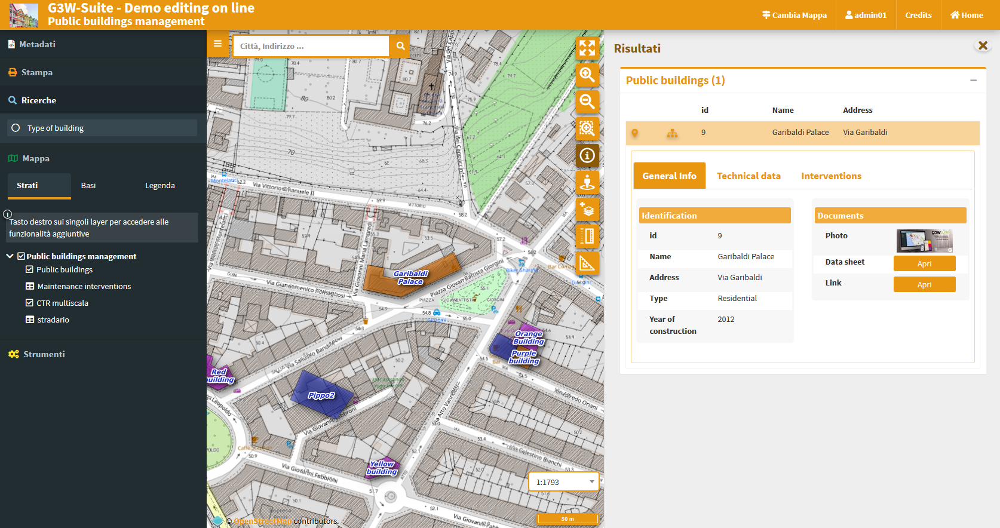

# G3W-CLIENT: the cartographic viewer
## Generic aspects

The application has a responsive interface consisting of expandable and reducible sessions.

The color of the interface depends on the type of user logged in.

**`The header`** contains the following elements:
 * **Logo, title and subtitle**, deriving from:
   * main title (set at General Data level) or MacroGroup name, according to the settings
   * Cartographic Group name
   * WebGis service title
 * **Change map:** which allows you to switch from one WebGis service to another (located within the same Cartographic Group) while maintaining extension and display scale
 * **User ID:** if you have logged in to the system
 * **Credits**
 * **Home:** to access the FrontEnd

The **`Tools panel`** is located on the left and containing the following objects:
 * **Metadata:** content defined on QGIS project
 * **Print:** printing tool based on the layouts defined on the QGIS project
 * **Search:** with the search tools defined through the Administration panel
 * **Map:** containing:
   * **Layers:** structured list of layers, defined on the QGIS project
   * **Base:** choice of the base map from those defined at the creation level of the Thematic Group
   * **Legend:** graphic legend of the various layers
 * **Tools:** session that collects the various tools that may be activated on the WebGis service

The centrally located **`map area`** presents the various navigation and map interaction controls, this controls are defined at the Cartographic Group level.

## Navigation and interaction with the map
**The icons and description of the functions of the various **`MapControls`** activated at the thematic group level are shown below.**

 *  **`zoomtoextent`:** zoom to the initial extension
 *  **`zoom`:** zoom in and zoom out
 *  **`zoombox`:** zoom tool based on drawing a rectangle
 *  **`query`:** puntual query of geographical layers
 *  **`querybbox`:** query via bounding box - **N.B.** for the layers to be queried according to this method it is necessary that they are published as WFS services on the QGIS project
 *  **`querybypolygon`:** it will be possible to automatically query the features of one or more layers that fall within a polygonal element of a guide layer. (Eg what's inside a cadastral parcel?). - **N.B.** the questionable layers must be published as WFS services on the QGIS project
 *  **`geolocation`:** geolocation tool (useful for consultation from tablet)
 *  **`nominatin`:** search tools for addresses and toponyms based on OSM
 *  **`streetview`:** Google StreetView on your map
 *  **`length`:** linear measuring instrument
 *  **`area`:** tool for measuring surfaces
 *  **`addlayers`:** tool for temporarily uploading GeoJson ,KML and SHP (zipped) vector layers to WebGis
 *  **`snapshot`:** tool for taking snapshots of the map area

It should be noted that the query function acts, by default, with the coring method, providing information relating to all the layers underlying the point where you click with the mouse or draw a box.

To query a single layer, it must be previously selected at the TOC level.

Remember that query modes based on **querybbox** and **querybypolygon** require the publication of the layers as WFS services at the QGIS project level.

**NB:** Remember that, after viewing the results, it will be possible to zoom on the feature associated with the individual results only if the option **`Add geometry to object response`** has been activated at the QGIS project level (**`Project → Properties, QGIS Server session`**).

### Attributes form

In the QGIS project (**`Vector properties → Attributes Form`**), you can create custom attribute forms (tabs, groups ...)

The same structured form will be reported at the query level on the cartographic client.

Any links to photos will determine the display of a clickable preview, any links to links or other multimedia content will determine the display of the Open button that will allow consultation of the link.

For further information on this point, see the [**dedicated paragraph**](https://g3w-suite.readthedocs.io/it/latest/projectsettings.html#viewing-multimedia-content).

### Display of 1:n relation data

In the event that, at the QGIS project level, one or more type 1: n relationships have been associated with a layer, the icon **View Relationships**  will be shown in the attribute form.

By clicking on the icon you will access the list of relationships present and, from these, the list of child records associated with the individual relationships. In the case of a single 1: n relationship, the child layers of the relationship in question will be displayed directly.

A filter, applied generically to the contents of all fields, will allow you to filter the list of child records.

In the case of links to multimedia contents, the previews of the images and/or the **`Open` button** will be displayed for consultation of different types of content.

## Tools panel
### Metadata
The metadata reported in this session derive from those set at the QGIS project level.

This content is divided into three sessions: **General, Space Info and Layers.**
 * **`General`:** reports the **metadata defined on the QGIS project** in the item: **`Project →  Properties (QGIS Server session, Service Capabilities)`**
   In case of login as anonymous user the URL of the WMS service is shown.
 * **`Spatial`:** reports the **EPSG code** of the projection system associated with the QGIS project and the **BoundingBox** relating to the initial publication extension, defined in the item: **`Project →  Properties (QGIS Server session, WMS Capabilities, Advertised extent)`**
 * **`Layers`:** reports **simple metadata associated with the individual layers**.

### Print
**Printing tool based on layouts defined on QGIS project.**

The tool allows you to choose:
 * **Template:** print layout among those associated with the published QGIS project
 * **Scale:** print scale
 * **DPI:** print resolution
 * **Rotation:** rotation angle
 * **Format:** print to PDF or JPEG

On the map, a lit rectangular area will allow you to define the print area.

### Search
**The Search menu contains the list of search tools defined through the Administration panel.**

You choose the search you are interested in, fill in the required fields and click on the **`Search` button**.

The **panel with the list of results** will open on the right side of the client, for each result the first three fields of the associated table will be displayed.

By positioning on the individual results, the corresponding features will be highlighted on the map; clicking on the individual results you can consult all the attributes.

The **drop-shaped icons** will allow you to **zoom in on the extension** relating to the resulting overall features or that of the individual features.

The **`CSV` icon** allows you to download the attributes associated with the features in CVS format.

### Map
 * **Layers:** structured list of layers, defined on the QGIS project
 * **Base:** choice of the base map from those defined at the Cartographic Group creation level
 * **Legend:** graphic legend of the various layers
 
   The right button on the name of the single layer shows the following items:
 * **Zoom to layer:** to zoom in on the extension of the layer
 * **Open the attribute table:** to consult the associated attribute table
 * **Download shapefile:** to download the layer as a shapefile; available only for PostGis and SpatiaLite layers following activation of the function from the administration panel
 * **WMS URL:** URL of the WMS service relative to the project or URL of the external WMS

The attribute table is equipped with **paging function, highligth function and zooming** to the associated features.

In the case of links to **multimedia content**, the previews of the images and/or the **Open** button will be displayed for consultation of different types of content.

**A filter**, applied generically to the contents of all the fields, will allow you to filter the list of displayed records.

