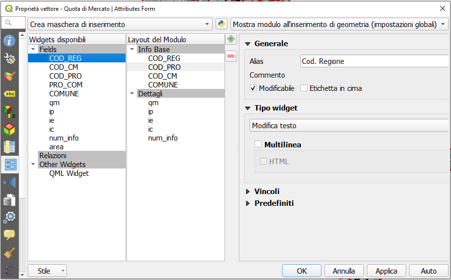
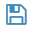
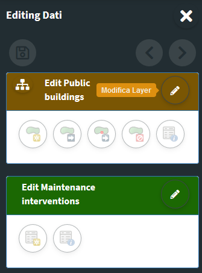
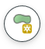

# Online editing
## Activation and configuration

The G3W-SUITE platform allows you to manage and create editing on **`PostGis or SpatiaLite layers`** present within published projects.

The tool also allows you to manage **`relational type editing (1:1 and 1:n)`**.

The **editing settings** are defined partly at the **QGIS project level** (**editing form structure, widgets associated with individual attributes, 1:n relationships**) and partly at the **Administration level** (users with editing power, activation scale, any geoconstraints).

It should be noted that this function manages **`multi-user editing`** through a **features-lock system**.

When an enabled user activates the editing function at the map client level, the **features visible on the map at that time will be blocked**, in relation to the editing aspect, **for all the other enabled users** who will still be able to edit features present outside this geographical extension. .

This block will be deactivated when the user exits the editing mode.

### QGIS project settings
#### Definition of the attribute editing form
In the QGIS project, for each layer it is possible to **define the structure of the attribute display module**.

The same structure will be used in the cartographic client when editing attributes.

The definition of the form structure can be managed, on QGIS, from the **`Properties of the vector`, in the `Attributes Form section`**.

#### Definition of editing widgets associated with individual attributes
At the QGIS project level (always from **`Vector Properties`**, **`Attribute Form`** section) it is possible to define an alias and an editing widget for each attribute.

The alias and editing widgets defined at the project level will be available during web editing with some limitations.

Below are the available widgets and any limitations:
 * **`Checkbox`**
 * **`Date/time`:** management of the date only
 * **`Attachment`**
 * **`Range`**
 * **`Text edit`** with this excluded options:
   * multiline
   * html
 * **`Unique values`**
 * **`Value map`**
 * **`Value relations`** with this excluded options:
   * sort by value
   * allow multiple selections
   * filter expression
   
With regard to the **`Attachment widget`**, it is necessary to specify that the association of a multimedia file with a feature requires that this file is uploaded to a dedicated space (exposed on the web) on the server and that the association takes place via a URL that refers to that file.

This solution allows you to consult the associated attachments also from QGIS or from other GIS software.

**Additional settings at single layer level**

In the **`Attribute Form`** section of the **`Layer Properties`** it is also possible to define whether:
 * **the attribute can be modified**
 * **any default values**

The **mandatory and/or unique constraints** have to be defined on PostGreSQL/PostGis table level.

#### Definition of 1:n relations
In the event that, at the QGIS project level, one or more 1: n type relationships have been associated with a layer (**`Project menu → Properties…`, `Relations` section**), it will be possible to carry out relational editing also on the webgis platform.

Also for the tables related in 1:n mode it will be possible to define the **attribute form structure, aliases and editing widgets** in the QGIS project.

These configurations and tools will automatically available  on the webgis platform.

### Administration settings

#### Activation of layer editing
To activate the online editing functions, access the **`Layer list`** section of the project within the administration panel of G3W-ADMIN.

Identify the PostGreSQL/PostGis or SpatiaLite layer on which you want to activate the editing function and click on the **`Editing layer` icon**  located on the left 

Clicking on the icon will open a modal window that will allow you to:
 * **define the editing activation scale** (only for geometric tables)
 * **define the Viewer users** (individuals or groups) **enabled** for online editing

With regard to the last aspect, it should be noted that:
 * **Viewers users** (individuals or groups) **available** in the drop-down menu **will be limited to those who have allowed access in consultation to the WebGis project**
 * **Editor1 and Editor2 users**, **owners** of the project, are **enabled by default** to the online editing function

#### Activation of relational editing
To allow editing on the related table in mode 1: n , the **editing function must also be activated** (always in the same way) **also for the related table** present in the project layers list.

#### Geo-constraints setting
**The online editing function also allows you to manage geo-constraints that allow the user to insert/modify features only if they intersect or are contained within specific features of a second polygonal layer.**

To activate a geographical constraint, you must click, always at the level of the list of project layers, on the **`Constraints list` icon**  which will appear once the online editing function is activated.

Clicking on the icon will show the list of any existing constraints and the item **`+ New constraint`** to create a new geo-constraints.

The icons placed next to any constraints already present allow you to edit/delete the constraint itself.

Clicking on the item **`+ New constraint`** will open a modal window which will allow you to **define the polygonal layer** (among those present in the project) **on which the constraint itself must be based**.

Once the layer has been defined, the constraint will appear in the list and can be parameterized using the **Rules icon** 

Clicking on this icon will open a modal window which, by pressing the green button **Add** , it will allow you to **define, for each user and/or group of users, the rules of the constraints**.

The rules definition will be done through a freely compiled **`SQL expression`**, which must refer to the attributes and values of the layer defined as geo-constraints.

The **`Save icon`**  will allow you to validate the SQL itself, in order to ensure proper functioning of the constraints itself.

Once all the constraints have been entered and validated, click on the **Close button** to confirm the rules.

## Online editing tools at cartographic client level
### Direct editing
**Once the online editing function has been activated and configured on one or more layers of a WebGis project, the `Editing` item, inside the `Tools` menu of the cartoographic client, will be shown.**

 

By clicking on the **`Data Layers`** item, the side menu will show the editing tools for all the layers on which this function is activated.

The actual activation of the editing function for the individual layers will take place by clicking on the **`Edit layer`** icon.

#### Create and edit features

The tools available are the following:

**Geometric layers**
 *  **Add feature:** to add a feature
 *  **Move feature**
 *  **Update feature vertex:** to modify the shape of a geometry
 *  **Remove feature**
 *  **Modify feature:** to modify the attributes associated with an existing feature

Activating the **Add features** and **Update feature vertex** tools allows you to activate the snap intralayer function.

**Alphanumeric layer**
 *  **Add feature:** to add a record to the alphanumeric table
 *  **Modify features:** to modify the attributes of an existing record

Whenever a new feature/record is added or an existing feature/record is update, the attribute editing form and the respective editing widgets will be displayed as defined at the QGIS project level.

Any **mandatory fields will be marked with an asterisk**.

Any **unfulfilled constraints will be highlighted** with specific warning messages shown **in red**.

The changes made can be saved only after satisfying any constraints of mandatory and/or uniqueness.

For this reason the green button **SAVE** will be disabled until all constraints are met.

#### Saving changes
Saving all the changes made in an editing session can be done in two ways:
 * by clicking on the **`diskette icon`**  placed at the top right. The changes made will be saved and you can continue making new changes
 * by deactivating the editing by clicking on the **`Edit layer icon`** . 

By deactivating the editing function, a modal window will be displayed which will show the **list of changes made** and the request for confirmation or not of saving them.

Remember that during the editing phase the **`undo/redo icons`**  allow you to delete/restore the latest changes made.

### 1:n related tables editing
**G3W-SUITE allows for relational editing**; for this to be possible it is necessary that:
 * on the published QGIS project there are one or more geographic layers related (1: n) with one or more alphanumeric tables
 * on the administration panel the editing function has been activated both on the parent layer and on the child layers
 * the operator user is enabled for the editing function on these layers

**The activation, at the cartographic client level, of the editing mode on the parent layer automatically determines the possibility of also managing the information on the related table.**

The insertion of a new geometry or the modification of an existing one determines the display of the attribute form divided into two or more macro tabs, one for the parent layer and the other for the child layers

Moving on the macro tab relating to one of the child layers, the list of records already associated with the edited feature will be displayed

In this macro tab it will be possible to:
 * **create and add a new records** related to the edited feature
 * **associate an existing records** (linked to other features or orphan) to the edited feature
 * **modify the records** currently associated with the edited feature

#### Creation of a new related records
By clicking on the icon **`Create and link a new relation`** (located at the top right) it will be show the attribute form to insert a new record.

You can fill in the individual attributes and save the new record. **The change must be validated by clicking on the `Save` button at the bottom of the form.**

#### Association of an existing record
By clicking on the icon **`Join a relation to this feature`**  (located at the top right) you can associate a record, already linked to other features or orphaned, to the edited feature.

In the new window displayed:
 * the list of all orphaned or already associated records will be displayed;
 * a generic filter will allow you to locate the record of interest;
 * by clicking on the individual records these will be associated with the edited features and, possibly, dissociated from other features

#### Modification of an already associated record
A series of icons appear to the right of each record associated with the edited feature:
 *  **Unlink relation:** to dissociate the record from the edited feature, the record will not be deleted but will become an orphan
 *  **Delete feature:** permanently delete the record
 *  **Update feature:** modify the values associated with the attributes of this record; the change must be validated by clicking on the Save button at the bottom of the form.

#### Saving changes
Saving changes made at the level of related tables is managed by saving made at the level of the parent layer:
 * by clicking on the **`diskette icon`**  placed at the top right. The changes made will be saved and you can continue making new changes
 * by deactivating the editing by clicking on the **`Edit layer icon`** . 
 
By deactivating the editing function, a modal window will be displayed which will show the list of changes made and the request for confirmation or not of saving them.

 
