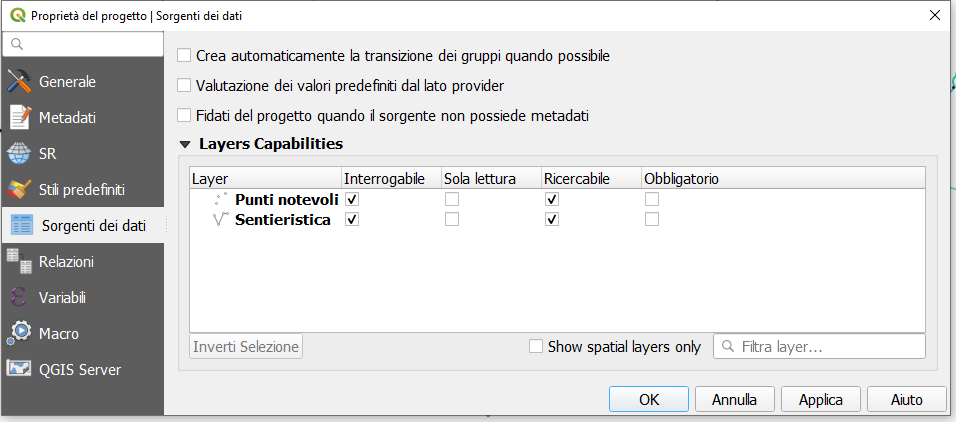
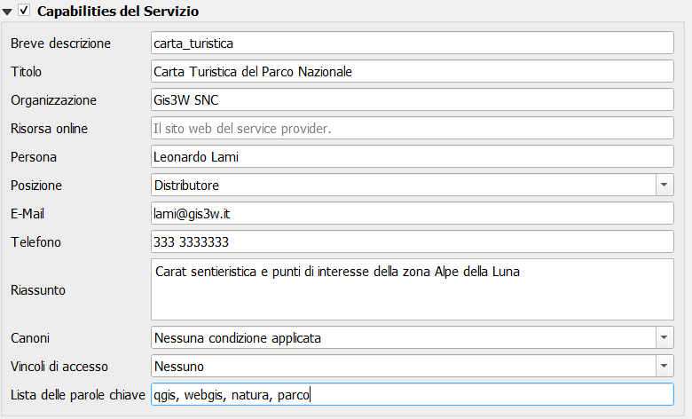
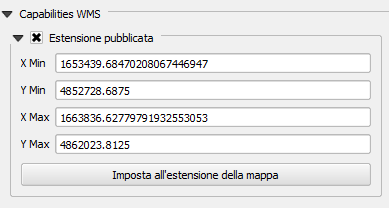

# QGIS: project settings

_**This section describes how to optimize your QGIS projects for publication as a WebGis service.**_

Thanks to the integration with QGIS Server, all the symbology aspects associated with the singoly layers are automatically reproduced on the WebGis service

In the QGIS cartographic projects you can set some parameters and options that affect functionalities and contents in the derivative WebGis service, such as:
* the **webgis service identification name**
* the associated **basic metadata**
* the **capabilities of the service**
* the **geographical extension** displayed when the WebGis service starts
* the **projection systems** for which the OGC services are available
* the possibility to **exclude some associated print layouts** on the WebGis service
* which layers are **queryable and searchable**
* which vector layers can be **queried using WFS**
* which **fields** (for each vector data) and with which **aliases** are made visible following interrogation on the WebGis service 
* the **structure of the query form** visible on the WebGis service
* the associated print layouts
      
The following paragraphs describe which QGIS project settings are more relevant in relation to the published WebGis service.

## QGIS: project property
From the **`Project → Properties`** menu, you can access the **`Project Properties`** window and the three submenus of our interest:
 * **General**
 * **Data sources**
 * **QGIS server**
 
### General
#### General Settings
**In this section it is possible to define the title of the project, consequently the `title of the WebGis service`.**

This title will be used at the G3W-SUITE application level to uniquely identify the published project; for this reason **it will not be possible to assign the same name to different projects published on the WebGis service**.

**We advise against using special characters, or numbers in the project name.**

### Data sources
**This submenu defines `the layers that can be queried` at the WebGis service level.**

Check the **Identifiable** column for the layers that we want to query on the WebGis

### QGIS Server

##### Service capabilities
**In this section it is possible to define the `capabilities of the service`**.

This information, together with info about the structure of the attribute tables of the layers present in the project, will be displayed in the **Metadata session** of the cartographic client.

See also [dedicated paragraph] (https://g3w-suite.readthedocs.io/en/latest/g3wsuite_client.html#metadata)

##### Capabilities WMS - Advertised extent
**In this section it is possible to define the `geographical extension` displayed when the WebGis service starts.**
    
To define it, set the desired geographical view on the map and then click on the **'Use Current Canvas Extent'** button.

##### WMS Capabilities - CSR restrictions
**In this section it is possible to define the `projection systems` for which the project is available in relation to `OGC services`.**

It is clearly necessary to insert the projection system on which the project was made, this SR is added by clicking on the **'Used'** button.

Other geographic reference systems can be implemented by clicking on the **'+'** button and choosing from the list of reference systems.

##### Capabilities WMS - Exclude layouts
**In this section it is possible to `exclude some of the print layouts` that are associated with the cartographic project from the availability of the WebGis service.**

##### Capabilities WMS - General aspects
Two further aspects are manageable with regard to WMS capabilities
 * in general it is recommended to check **`use the layer ids as names`** option
 * the option **`Add geometry to feature response`** must be checked to activate the **zoom to the features** on the WebGis service

##### WFS Capabilities
**In this section it is possible to define which `layers are exposed as WFS services`.**

The WFS service is needed if you want activate following types of query:
 * **bbox query**
 * **bypolygon query**
 
It is sufficient to check only the **`Published`** column
 
 

## Print layouts
Any print layouts associated with the published QGIS project will automatically be associated with the published WebGis service.

**Print layouts must contain only one `Map` element**.

Any images present in the print layouts must be placed in the local **`geo_data`** folder (in any subdirectory) and synchronized on the server.

See also the dedicated paragraph [Geographic data synchronization on the server](https://g3w-suite.readthedocs.io/it/latest/datamanagement.html#geographic-data-synchronization-on-the-server).

## QGIS: layer properties
### Simbology
The rendering style associated with the individual layers is replicated autonomously on the WebGis service.

If external SVG icons are used (added to the basic ones of QGIS, via the **`Settings -> Options -> System -> SVG paths`**), these must be uploaded to the server (through the **`File Manager`** tool) in order to be used by QGIS Server.

#### Manage custom SVG icons
In the installation procedure of the G3W-SUITE application, an **`svg`** named directory is created on the server.

Within this directory it is therefore possible to store SVG icons, also organized in subdirecory.

The **`Configurations icon`** , located in the upper right corner of the **Administration Panel**, allows you to access a menu that includes the **`File Manager`** item.

Through this tool it is possible to manage SVG icons on the server in a simple and intuitive way.

The SVG folder on the server must reflect the structure in any subfolders present locally.

**NB:** The name of this directory is defined by the basic settings set during the installation of the suite.
[See dedicated paragraph.](https://g3w-suite.readthedocs.io/en/latest/settings.html#base-settings)

**PS:** remember that the **`File Manager`** tool also allows you to manage the synchronization of geographical data (in the case of using physical files) and the management of multimedia files. 

See also [dedicated paragraph](https://g3w-suite.readthedocs.io/en/latest/projectsettings.html#viewing-multimedia-content)

### Definition of the fields that can be consulted for each layer
Within the QGIS project it is also possible to define, for each layer, which fields are available following query on the WebGis service.

To define these settings, you access the properties of one of the vectors previously defined as searchable and choose the **`Source Fields`** submenu in the **`Layer Properties`** window.

This submenu lists the fields associated to the table of the vector.

The check box relating to the **`WMS`** column defines whether or not the values contained in this field will be available following the query on the WebGis service.

 
 
### Viewing multimedia content
Multimedia contents (images, pdf, web URL ...) can be viewed interactively on the map client following publication of the QGIS project.

In the case of web links, simply insert them (preceded by the prefix **`http://`** or **`https://`**) within the dedicated attribute fields

In the case of multimedia files it is necessary:
 * **upload the media file to the `media_user` folder** (folder exposed on the web) accessible through the **`File Manager`** tool in the Suite Administration Panel
 * **insert the web link to this file in the dedicated attribute field**

The link to the file can be obtained in the following way:
 * **`application domain + media_user + path of the file + file name`**

Example:
 * application domain: **`https://dev.g3wsuite.it`**
 * file **`file_A.pdf`** located in the folder **`/media_user/form/`**
 * web link: **`https://dev.g3wsuite.it/media_user/form/file_A.pdf`**

Following queries at the cartographic client level, we will have different behaviors based on the type of content:
 * **image**: preview display in the form, click on the preview to display the image in real size
 * **web link or other multimedia file**: display of an **Open** orange button to allow consultation of the content

 

### Definition of the attribute display form
For each layer it is possible to define the structure of the attributes form associated with displaying the results following query operations.

On QGIS we can build a personalized form (query form) by creating thematic tabs and groups and defining the distribution of the individual fields and their aliases.

This structural organization will be replicated directly on the query form on the WebGis service.

 

## Performances optimization

### Mandatory rules
* PostGreSQL/PostGis and SQLite/Spatialite layers must have a **primary key**
* PostGreSQL/PostGis and SQLite/Spatialite layers must have **only a geometric column**
* **not use numeric type** field in PostGreSQL/PostGis layer
* the primary key field and all fields involved in search, join, 1:n relation or editing function have to be **published as WMS**
* **don't use commas for aliases** associated with layers.
* style settings defined at the auxiliary data level are not managed.
* insert only **one `Map` element in the print layouts**.

### Tips
* when using rule-based/categorized classification **create indexes on the column(s) involved** in the rule expression
* start the project with **only a few layers turned on** by default
* do not exceed three nesting levels in the groups of layers defined in the TOC
